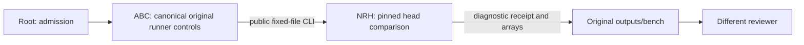

# Explicit QF3 diagnostic route

`qf3-head-check` is an inference diagnostic. It cannot qualify training, first-target selection, or evaluation success.

Use the original Python from this isolated controller checkout. The public command is:

```sh
/home/user/aditya/RL/abc/.venv/bin/python -B -m abc_bench.runner \
  --algorithm qf3-head-check \
  --training-config ABS_ROOT_ADMITTED_CONFIG \
  --head-check-config-sha256 EXACT_CONFIG_SHA256 \
  --checkpoint /home/user/aditya/RL/abc/cache/vla_abc130k_200000_v2.pt \
  --results /home/user/aditya/RL/abc/outputs/bench \
  --timeout-seconds ROOT_ADMITTED_PARENT_SECONDS
```

This is a command template, not launch permission. Root must select finite budgets, authenticate source/config, and review GPU admission. The child budget must leave at least60 seconds for parent cleanup. No config rewrite or recipe change occurs.

The route requires original `sys.prefix`, canonical `RESULTS` resolution and requested results. Root must connect this worktree's `outputs/bench` to the original canonical directory. Root must verify its shared lock/ledger identity before use. The child file path is fixed. Its source SHA256 is embedded in this runner. There is no arbitrary worker-path override or private NRH import in ABC.

The original GPU0 occupancy check, exclusive lock, UUID reservation, finite precharge, `execute_command`, process-group watchdog/reap, elapsed accounting and publication remain in use. The child is launched with `sys.executable`. It checks the original active-parent ledger reservation and held lock. Only this diagnostic passes its admitted child `max_wall_s` to `execute_command`. Parent reservation and elapsed accounting still use the finite parent budget. Ordinary routes keep their original timeout. Parent accepts only the diagnostic receipt kind/stage, completed status, exact child/config hashes, false performance claim, and integer-zero controls/updates/worlds. A failed child keeps its receipt hash and first error. A running or training receipt cannot pass this route.

The original NRH0.4.10 sources, runtime, base loader and learning recipe remain unchanged. The separately pinned NRH diagnostic uses the original config to restore continuation identity. Its schema, bounded decode, preservation and output contract are documented in `sadhana-qf3-head-check/harness/docs/QF3_HEAD_CHECK.md`.



Root owns launch admission. ABC owns process and budget control. NRH owns inference. The reviewer checks the handoff. CPU fixture checks passed; native parity remains pending. This explanation uses STE guidance. Full ASD-STE100 compliance was not checked.

The owner ran18 focused CPU cases and89 existing runner/resource cases. Installed full editable packages and CLI help were checked without Torch. Fixtures test refusals, retained failure evidence, state preservation and accounting. They do not test native numerical equivalence. Commands and original terminal records are in `/home/user/aditya/RL/builds/qf3-head-check-implementation-20261009/README.md` and `TEST_EVIDENCE.json`. The focused repair evidence is in its `repair-v1` sibling.
