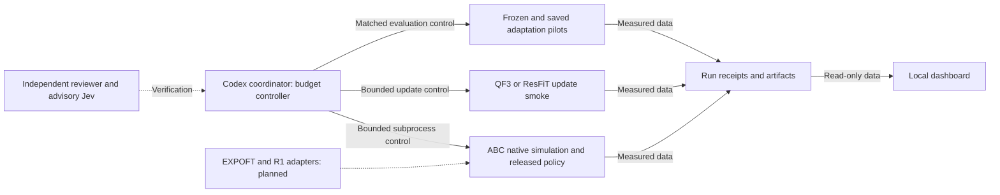

# ABC benchmark campaign

Owner: Codex / Sadhana. All files remain under `~/aditya/RL/abc`.

This campaign uses one GPU for at most two hours. The coordinator reserves GPU 0. The global lock and ledger live in `outputs/bench`. They apply even when a run has a different results directory. Job cancellation stops the complete subprocess group.

## Reproduce

```sh
uv sync --frozen --extra dev
uv run prepare.py --sim-task put_plastic_bottles_in_bin --checkpoint
uv run python -m abc_bench.runner --chunks 2 --worlds 1 --video
uv run python -m abc_bench.runner --chunks 236 --worlds 3
uv run python -m abc_bench.runner --algorithm qf3 --timeout-seconds 600
uv run python -m abc_bench.runner --algorithm resfit --timeout-seconds 600
uv run python -m abc_bench.runner --algorithm comparison --qf3-state outputs/bench/<qf3-run>/adaptation.pt --resfit-state outputs/bench/<resfit-run>/adaptation.pt --timeout-seconds 1800
uv run python -m abc_bench.dashboard --results-root outputs/bench --port 8766
uv run python -m abc_bench.dashboard --results-root outputs/bench --export outputs/bench/dashboard.html
```

Use the coordinator command for GPU updates. Do not call the GPU update worker directly. The worker checks its parent's campaign lease. Imports do not initialize hardware or start a job. The dashboard cannot launch training or robot commands.

## Evidence and limits

Native policy evaluation uses the released bottles checkpoint and the upstream evaluation entry point. The default baseline uses ten Euler steps. It disables compilation and RTC. Cold calls remain in the logged latency samples. Terminal chunks can lack a latency record. No real-time deadline claim follows from these measurements.

A short rollout has no published task-success result. A full-horizon pilot has an episode count and success count. The count remains visible. Three episodes do not establish a reliable population success rate. Compare only runs with matched conditions.

QF3 update smoke uses the actual pretrained ABC-DiT head. Its rank-four output adapter and fitted immediate-return critic are declared adaptations. ResFiT update smoke uses frozen features and an invertible action codec. Neither smoke establishes a faithful paper reproduction or convergence. Real-Time EXPO-FT still needs an ABC bridge. See `algorithms.md` and `update_smoke.md`. The matched evaluator loads their saved snapshots and compares them with the frozen policy. It creates a fresh environment for each method and seed, verifies initial joint and object positions, and uses the same noise and action cadence. See `paired_eval.md`.

R1 Lite and R1 Pro have static asset inspection receipts. Neither has a verified ABC task adapter or compatible policy checkpoint. Missing metrics remain unavailable. See `embodiments.md`.

Large checkpoints, downloaded scenes, videos, and raw run receipts stay outside Git. Commit the source pin, dependency lock, verification notes, and compact campaign summary. Each run links its execution log and hashed summary.

A standalone architecture diagram is in [architecture.svg](architecture.svg).

## Architecture



I coordinate the runtime and measurements. The algorithm agent checks the objectives. The embodiment agent checks model contracts and connects the update smoke. The UI agent displays evidence. The independent reviewer checks failure behavior and claims. Jev supplies advisory judgments.

This explanation uses ASD-STE100 guidance. A full vocabulary and grammar compliance check has not been performed.

Installed runner entry points use `ABC_BENCH_REPO` to select this checkout. The simulator requires its downloaded checkout assets. Lightweight dashboard imports need no GPU runtime.
