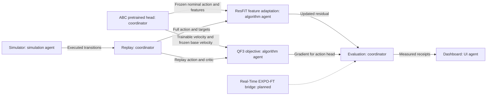

# Algorithm evidence and integration boundaries

Sources checked 2026-10-07. These components do not establish convergence or a faithful reproduction of published results.

## Sources and installed boundaries

- [QF3 paper](https://qf3-rl.github.io/data/qf3.pdf), equations 3–4 and section 5.2. The project marks official code forthcoming. `qf3_actor_loss` implements the clipped one-step objective and optional frozen-base velocity anchor. It accepts a critic callback. It does not implement replay, TD3 critic training, LoRA, or integration through ABC's action head.
- [Official ResFiT](https://github.com/amazon-far/residual-offpolicy-rl), local source `/home/user/aditya/RL/residual-offpolicy-rl`, commit `66262b06a0caf159fb001504949b7b48ccda5f64`. [Paper](https://arxiv.org/abs/2509.19301). Official `QAgent` accepts CHW camera tensors, proprioception, action dimension, and `QAgentConfig`. `update` consumes a TensorDict with `obs`, `action`, `('next','reward')`, `gamma`, `nonterminal`, and `('next','obs')`. Each observation contains camera keys, `observation.state`, and `observation.base_action`. The current replay action must be the full executed action. The actor learns the bounded residual. The shipped wrapper imports DexMG and ACT; it is not an ABC adapter.
- [Official Real-Time EXPO-FT](https://github.com/pd-perry/expo-ft), local source `/home/user/aditya/RL/expo-ft`, commit `21fe3d3b7d913c80836496817965932f49e0aedf`. [Paper](https://arxiv.org/abs/2609.18207). `RealTimeEXPOFTLearner` is a JAX/Flax learner with OpenPI pi0.5 integration. It needs the separate real-time OpenPI fork and delayed replay. Its noise-Q filter learns which noise seed to denoise for the backup. Its fast policy uses current observations to edit candidate chunks. Its slow policy uses delayed observations and prefix conditioning. `select_candidates` verifies only the conservative candidate-selection arithmetic. It is not Real-Time EXPO-FT.

## Runnable feature adaptation

`ResFiTFeatureLearner` is a small ResFiT-style adaptation. It keeps the caller's base policy frozen. It learns a bounded residual from frozen features and the nominal action. Ten full-action critics supply random-pair targets and ensemble-mean actor gradients. Zero residual initialization reproduces the nominal action. This initialization is an engineering choice. The adaptation uses MSE averaged across heads, not every optional loss in the official release. It applies target smoothing in unit residual coordinates before residual scaling. `target_noise=0.025` and `noise_clip=0.3` are declared adaptation defaults. The smoothed residual stays within its bound. Actor updates occur after critic updates 2, 4, and subsequent even updates. It does not train visual encoders.

The caller must provide `obs`, `action`, `nominal`, `next_obs`, `next_nominal`, `reward`, and `discount`. Shapes are documented in the module. Supply already accumulated discounted rewards and `gamma**ticks` discounts. Set discount to zero for task termination. Preserve bootstrap at a time limit with the true final observation. The caller owns equal offline/online sampling, n-step replay, warmup, checkpoints, and provenance. Do not claim ResFiT's complete recipe unless these requirements are met.

## ABC flow convention

ABC uses reverse time. Its path is `x=(1-t)*action+t*noise`. Its target velocity is `noise-action`. The endpoint estimate is `x-t*v`. Set `reverse_time=True` in the QF3 objective. The clipped endpoint becomes `action-t*clamp(v-(noise-action),-alpha,alpha)`. Forward paper time is `tau=1-t`, and forward velocity is `-v_ABC`.

Freeze critic parameters during the actor objective. Keep the action input differentiable. Supply frozen base velocities from the same observation, noise, and time. Use the actual pretrained action head. Do not replace it with a new flow network and call that pretrained fine-tuning. Convert physical actions to the declared normalization before replay. Preserve the actual issued chunk prefix and reward duration.

## Real-Time EXPO-FT bridge plan

1. Implement an ABC wrapper for observation preprocessing and prefix-conditioned chunk generation.
2. Provide a trainable behavior-cloning path. The official implementation updates the base policy through imitation, not critic gradients.
3. Implement current-state edit conditioning and normalized action windows.
4. Store delayed observations, committed prefixes, noise seeds, actual executed windows, and discounted rewards.
5. Reproduce the learned noise-Q filter and critic backup selection.
6. Use an asynchronous scheduler with controlled latency. Measure observation age and deadline misses.
7. Verify zero-delay and delayed behavior. Compare with matched candidate counts and compute cost.

No official ABC bridge or R1 checkpoint was found in these repositories. No EXPO-FT training was run by this agent.

## Architecture and owners

This agent checks algorithm math. The coordinator connects policies and replay. The simulation agent checks the environment. The UI agent displays recorded evidence. An independent reviewer checks tests and claims. The dashed connection is planned. This explanation uses ASD-STE100 guidance. A full vocabulary and grammar check was not performed.
