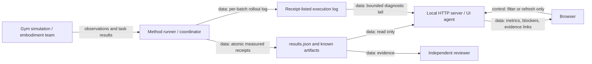
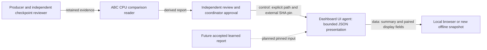

# Benchmark dashboard

The dashboard reads run receipts. It does not start training or control robots.
The runner owns measurements. The UI agent owns their display. An independent reviewer checks the evidence.
This explanation uses STE guidance. A full ASD-STE100 compliance check was not performed.

Run from the repository root:

```sh
python -m abc_bench.dashboard --results-root outputs/bench --port 8766
python -m abc_bench.dashboard --results-root outputs/bench --export outputs/bench/dashboard.html
```

Open `http://127.0.0.1:8766`. The CLI binds to localhost. Use an SSH tunnel for remote viewing.
No GPU, credentials, frontend packages, or simulator imports are required. The exported HTML contains a fixed data snapshot. It works without a server. Artifact links refer to the original files; keep those files with the snapshot. Export again to include new results.

## Evidence contract

Read `results.json` from the results directory. If absent, read `runs/*.json` receipts.
An empty directory shows no recorded runs. Missing values show **Unavailable**.
Smoke tests and benchmarks have separate filters. Each row states its implementation scope.
Diagnostic results do not establish faithful paper reproduction or real robot performance.

The canonical document uses `schema_version: 1`, `runs`, and `embodiments`.
A run contains:

- `run_id`, `algorithm`, `embodiment`, `task`, `seed`, `phase`, and `status`.
- `method_fidelity` or `claim_scope`, which describes implementation limits.
- `budget.wall_seconds` and `budget.steps`.
- `metrics.successes`, `metrics.episodes`, and `metrics.latency_ms.p50/p95`.
- Nullable `metrics.reward`, `simulation_steps`, `elapsed_seconds`, and `completion_time_seconds`.
- `blockers`, `checkpoint_path`, and `artifacts` with `label` and `path`.

Use JSON null for unavailable metrics. Never insert zero for an unmeasured value.
The current embodiment IDs are `native_yam` and `r1lite`.
Each embodiment records `id`, `label`, `status`, and `blockers`.

Artifact paths must identify existing files inside the results directory.
The server exposes only paths named in run receipts. It rejects external paths and symlink escapes.
Checkpoint paths display as text. The server does not expose them without an artifact entry.
Only image and video files display inline. Other files download as attachments.
Results remain local. The browser makes no external service requests.

## Architecture



The diagram shows the implemented dashboard interface. It does not assert that all methods or embodiments have run.
The dashboard has no control connection to training or hardware.
Jev is absent from this interface. The dashboard does not send review requests.

## Live QF3 diagnostics

Live receipts refresh every 30 seconds. The refresh button also reads the optional development report.
An offline export is a fixed snapshot. It does not poll the server.

A running QF3 ABC-VLA receipt can show its last valid rollout log record.
The log must be an existing `Execution log` artifact inside the results directory.
The reader reads at most 64 KiB from the end of that file per refresh.
It ignores partial lines, malformed JSON, duplicate keys, nonfinite numbers and invalid counts.
Missing or rejected log records leave the diagnostic absent.
The dashboard does not search for unlisted logs, checkpoints or model data.

Counts describe one batch: its namespace, controls, batched ticks, completed episodes and active worlds.
The elapsed time applies to that collector batch. The displayed timestamp is the file's modification time.
These are producer-reported diagnostics. They may lag behind the worker.
They do not establish cumulative training progress, admitted task success or benchmark completion.
The dashboard does not change stored receipts or their canonical metrics.
Terminal receipts do not retain this live diagnostic.

The coordinator owns the runner and the diagnostic parser. The independent reviewer checks the display contract.
The browser owns filtering and refresh. It cannot start or stop training.
This explanation uses STE guidance. A full ASD-STE100 compliance check was not performed.

## Verification

Run the HTTP and evidence checks without a GPU:

```sh
python -m unittest discover -s tests/bench -p test_dashboard.py -v
```

Checks cover missing metrics, malformed receipts, safe artifact access, and encoded path traversal.
The HTTP server supports full-file video reads. HTTP range requests are not implemented.
The dashboard provides no login. Keep the server on localhost.

## Optional ABC-VLA development report

The dashboard can present one externally approved CPU reader report.
Supply its path and its SHA-256 approval pin together.
Obtain the pin from the independent review or coordinator.
Do not calculate a replacement approval pin from an untrusted input.

```sh
python -m abc_bench.dashboard --results-root outputs/bench --port 8767 \
  --vla-report /path/to/approved-reader-report.json \
  --vla-report-sha256 APPROVED_64_CHARACTER_SHA256
```

Use `--export NEW_PATH.html` for a separate offline view.
A pinned-report export refuses an existing destination.
Keep historical snapshots and raw receipts unchanged.
The coordinator owns publication of actual approved reports.

The dashboard reads and hashes at most 4 MiB of report JSON per refresh.
It does not follow artifact references or hash model weights.
It does not import the comparison reader, policy, simulator, or GPU libraries.
It does not serve the report file or its referenced source paths.
The API returns only the display fields and report hash.

`/api/vla-comparison` is separate from `/api/results`.
The optional section leaves canonical run rows and artifact links unchanged.
Missing configuration or a rejected report shows unavailable values.
A changed report fails the approved hash check on the next refresh.
Duplicate JSON keys, nonfinite values, and incomplete summaries are refused.
Each displayed policy requires 50 complete episodes.
Paired counts must total 50 and agree with the policy success counts.

The supported frozen status is `validated_frozen_development_evidence`.
Its learned results and paired measurements remain unavailable.
The supported comparison status is `descriptive_fixed_development_comparison`.
It displays both policy summaries and both success definitions.
Wins mean learned-only success. Losses mean baseline-only success.
Common-success length changes use learned minus baseline control steps.
A negative change uses fewer control steps in that common-success subset.
Different successful subsets do not establish a speed gain.
Lengths are not native first-success times.

The report hash authenticates bytes, not producer truth or checkpoint selection chronology.
This view does not repeat the reader's artifact validation or authenticate independent approval.
This is native YAM development evidence. It is not R1 performance, held-out evaluation, or paper reproduction.
Synthetic learned fixtures remain software tests. They are not published experiment results.



The producer owns execution. The reader team owns evidence validation.
The coordinator supplies the approved report pin and owns publication.
The UI agent implements presentation. An independent reviewer checks this interface.
There is no control connection from the dashboard to training or hardware.
Jev is not used by this interface.
This explanation uses STE guidance. A full ASD-STE100 compliance check was not performed.

Focused CPU checks:

```sh
CUDA_VISIBLE_DEVICES='' python -m pytest tests/bench/test_dashboard_vla.py tests/bench/test_dashboard.py -q
```
