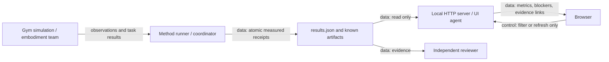

# Benchmark dashboard

The dashboard reads run receipts. It does not start training or control robots.
The runner owns measurements. The UI agent owns their display. An independent reviewer checks the evidence.
This explanation uses STE guidance. A full ASD-STE100 compliance check was not performed.

Run from the repository root:

```sh
python -m abc_bench.dashboard --results-root outputs/bench --port 8765
```

Open `http://127.0.0.1:8765`. The CLI binds to localhost. Use an SSH tunnel for remote viewing.
No GPU, credentials, frontend packages, or simulator imports are required.

## Evidence contract

Read `results.json` from the results directory. If absent, read `runs/*.json` receipts.
An empty directory shows no recorded runs. Missing values show **Unavailable**.
Smoke tests and benchmarks have separate filters. Each row states its implementation scope.
Diagnostic results do not establish faithful paper reproduction or real robot performance.

The canonical document uses `schema_version: 1`, `runs`, and `embodiments`.
A run contains:

- `run_id`, `algorithm`, `embodiment`, `task`, `seed`, `phase`, and `status`.
- `method_fidelity` or `claim_scope`, which describes implementation limits.
- `budget.wall_seconds` and `budget.steps`.
- `metrics.successes`, `metrics.episodes`, and `metrics.latency_ms.p50/p95`.
- Nullable `metrics.reward`, `simulation_steps`, `elapsed_seconds`, and `completion_time_seconds`.
- `blockers`, `checkpoint_path`, and `artifacts` with `label` and `path`.

Use JSON null for unavailable metrics. Never insert zero for an unmeasured value.
Embodiment IDs are `native_yam`, `r1lite`, and `r1pro`.
Each embodiment records `id`, `label`, `status`, and `blockers`.

Artifact paths must identify existing files inside the results directory.
The server exposes only paths named in run receipts. It rejects external paths and symlink escapes.
Checkpoint paths display as text. The server does not expose them without an artifact entry.
Only image and video files display inline. Other files download as attachments.
Results remain local. The browser makes no external service requests.

## Architecture



The diagram shows the implemented dashboard interface. It does not assert that all methods or embodiments have run.
The dashboard has no control connection to training or hardware.
Jev is absent from this interface. The dashboard does not send review requests.

## Verification

Run the HTTP and evidence checks without a GPU:

```sh
python -m unittest discover -s tests/bench -p test_dashboard.py -v
```

Checks cover missing metrics, malformed receipts, safe artifact access, and encoded path traversal.
The HTTP server supports full-file video reads. HTTP range requests are not implemented.
The dashboard provides no login. Keep the server on localhost.
