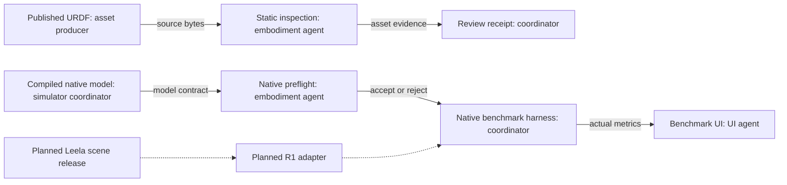

# ABC embodiment boundary

The implemented module inspects robot assets and rejects incompatible native bindings.
It does not replace the native robot or measure R1 task performance.

## Observed simulator contract

The public `abc_sim.make_env` function returns a Gymnasium environment.
`reset` returns observation and information. `step` returns five values.
`step_chunk` returns the final observation, history, reward, termination, truncation, and information.
A task evaluator supplies reward and success. A runtime can control task mechanisms.

The native YAM uses six arm joints and one gripper channel per arm.
Actions are absolute joint targets in radians. Gripper values use normalized opening.
The gripper conversion multiplies by `0.0475` metres.
The default physical time step is `0.002` seconds with 17 steps per control action.
Task defaults can change these settings. Record the resolved settings for each run.
The public action Box declares `[-1, 1]`; it does not describe all physical joint limits.
Do not infer safe physical ranges from that Box.

Joint and actuator names use `left_joint1` through `left_joint6`, then the right equivalents.
Finger names use `left_left_finger` and `right_left_finger`.
Gripper actuator names use `left_gripper` and `right_gripper`.
Camera names use `top`, `left`, and `right`.

The native mapper does not check failed MuJoCo name lookups.
A missing name returns `-1`. Python can then read the final array entry.
Call `validate_yam_model` before native index construction when using a replacement scene.
The check rejects missing names, non-scalar joints, and wrong actuator transmissions.
It does not validate controller gains or contact physics.

## Local asset evidence

These paths are read-only asset references. No private project modules are imported.

| Robot | Observed URDF | SHA-256 | Arm joints | Other movable joints |
| --- | --- | --- | --- | --- |
| R1 Lite | `~/aditya/yatra/assets/r1lite/r1lite.urdf` | `82504791ca5f1f4510e9d6bae683f30169d035d6ef62a3f315086008016c2f62` | Six per arm | Three torso joints, six base joints, four finger joints |
| R1 Pro | `~/aditya/yatra/assets/r1pro/r1pro.urdf` | `6d0edcef1e5cbec0cf51aa38ce58f67d75937b441c54d1f610f8bc1d02199a4e` | Seven per arm | Four torso joints, six base joints, four finger joints |

Lite references 65 mesh entries. Pro references 86 mesh entries.
Both URDF files use ROS `package://` mesh paths.
Explicit local package roots resolved all referenced meshes for both robots.
No missing mesh files or unresolved package references remained in that static check.
`inspect_urdf` requires explicit package roots to resolve those references.
A resolved mesh path does not establish asset licensing or simulation acceptance.
No source release manifest or applicable asset license was established here.
Therefore, this work does not copy or republish these assets.
Neither inspected URDF supplies the ABC actuator and camera contract.

## Required switch

1. Obtain a versioned, licensed scene release from Leela.
2. Resolve all meshes and record their checksums.
3. Define fixed-base manipulation or a separate whole-body control task.
4. Define joint order, actuator limits, controller gains, finger coupling, and opening conversion.
5. Define camera calibration, reset poses, object frames, and control frequency.
6. Verify reachability and contact stability for each task.
7. Validate reward and success on known successful and failed states.
8. Retarget demonstrations and verify executed actions before training.
9. Train and evaluate each robot under matched conditions.

Lite needs a validated 14-channel arm-and-gripper contract.
Pro needs 16 channels for both seven-joint arms and two grippers.
The Pro comparison therefore requires new policy input and output shapes.
A whole-body task needs additional base and torso channels or a documented lower-level controller.
Native YAM checkpoints cannot establish policy transfer without this work.

## Architecture and ownership

Solid lines show implemented inspection interfaces. Dotted lines show planned R1 integration.
The embodiment agent checks static assets and native model bindings.
The coordinator owns runtime setup, algorithm execution, and benchmark evidence.
Leela must supply an accepted scene and robot contract.
The UI agent displays measured results and explicit missing results.

Six focused tests passed in the existing ABC environment.
They cover mesh resolution, duplicate joints, missing names, and actuator mapping errors.
No GPU job or R1 task evaluation ran in this work.
This explanation uses ASD-STE100 guidance. It has not had a full compliance check.
