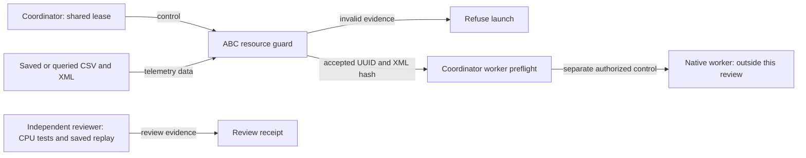

# Independent review of idle GPU telemetry

The narrow one-MiB rule is accepted for CPU source behavior and saved telemetry replay. Native execution remains separate.

The guard requires one matching GPU UUID. The combined process table must be present and empty. GPU and memory utilization must be zero. The display must be inactive. CSV and XML must both report exactly one MiB. Invalid, missing, duplicate, unknown, or failed telemetry causes refusal.

The XML query uses the selected UUID and a five-second timeout. Its UTF-8 hash enters the returned evidence. The memory cause remains unproven. Zero-memory behavior retains two queries. More than one MiB or a selected compute process causes refusal before XML.

Independent CPU checks passed: 82 resource tests, 143 benchmark tests, Ruff lint, Ruff format, and the diff check. Two saved actual XML snapshots also passed CPU replay. Every subprocess call in that replay was mocked. The reviewer ran no fresh GPU query.

Exact commands, exits, source hashes, XML hashes, and replay artifacts are recorded in [the JSON receipt](gpu_idle_telemetry_review.json).

The builder implemented the guard. The reviewer checked source, CPU failures, and saved telemetry. The coordinator owns the lease and native launch.

Telemetry is non-atomic. The campaign lease and worker identity checks remain required. This review does not prove current availability, native inference, or task performance. The full QF3 reproduction goal remains active.

The team explanation uses STE guidance. A full ASD-STE100 vocabulary and grammar check was not performed.
