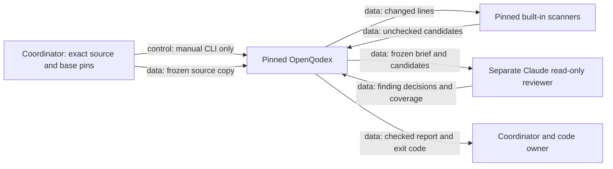

# Manual OpenQodex advisory review

OpenQodex 0.8.1 is installed under `~/aditya/runtimes/openqodex-0.8.1`.
The official repository is pinned at `549d3301702a739d62bd7296e2b9c94ce17af1ce`.
Node v22.16.0 uses the official archive and verified published checksum.
The npm tarball matches its published SHA-512 integrity value.
All 103 installed package files match that tarball.
The skill matches the pinned repository source.
Its location is `~/aditya/.agents/skills/openqodex`.
The next agent turn can discover the installed skill when this directory is in its skill search path.

The wrapper disables automatic updates.
`OPENQODEX_HOME` keeps tools, snapshots, and records under `~/aditya/.openqodex`.
Temporary files and package caches also stay under `~/aditya`.
Existing Claude authentication is used without printing credentials.
Claude authentication infrastructure remains in its existing user directory.
No new API key is required.

Do not run `init`, install hooks, or trust custom scanners for this workflow.
The coordinator owns engineering rules and publication.
OpenQodex owns scanner execution and its separate reviewer process.
The code owner owns later changes after review.
No scanner output alone establishes a complete review.
Do not replace a missing separate reviewer with a claimed independent self-review.

Use the pinned wrapper on an isolated copy:

```sh
~/aditya/runtimes/openqodex-0.8.1/openqodex review \
  --cwd /path/to/frozen-repository-copy \
  --base APPROVED_BASE_COMMIT \
  --reviewer claude --reviewer-web off --timeout 600 \
  --report-dir /path/to/new-review-output --format markdown
```

Keep tracked file contents and executable bits unchanged.
The tool makes another frozen snapshot for the reviewer.
Claude receives only read, search, and list tools.
The reviewer has no hooks, plugins, custom repository instructions, or session persistence.
The selected code goes to the model used by the existing Claude login.
Built-in scanners run without sending source code to their services.
Semgrep downloads registry rules. Those rule versions are not pinned.
OSV sends dependency names and versions only when matching dependency files change.
`--offline` disables Semgrep and OSV; record that reduced coverage.

Read the exact generated report.
Exit 0 means the tool completed its review without a configured blocking finding.
Default configuration warns; a passed verdict does not mean the code has no defects.
Exit 1 means a configured blocking finding was found.
Exit 2 means no complete review is available.
Report missing stages explicitly. Preserve report bytes and their hashes.
Keep tests, independent human or agent review, and benchmark acceptance requirements.



This workflow has no connection to GPU jobs or robot hardware.
This text uses STE guidance. A full ASD-STE100 compliance check was not performed.

The first exact UI review covered commit `c453f94` against `192ae8b`.
It found one incorrect error message for a malformed SHA pin.
The code owner fixed the message in commit `59ec623`.
Strict lowercase SHA validation remains unchanged.
All 27 focused dashboard tests passed.
The separate follow-up review passed with no findings.

- [Pinned installation evidence](openqodex_setup.json)
- [First exact review evidence](openqodex_ui_review.json)
- [First unchanged tool report](openqodex_ui_report.md)
- [Exact diagnostic-fix evidence](openqodex_pin_fix_review.json)
- [Unchanged diagnostic-fix report](openqodex_pin_fix_report.md)

Root integrated the accepted UI and diagnostic fix into `staging_attempt1`.
The original browser proof applies to the earlier UI source.
The diagnostic fix has its own test and review evidence.
The coordinator records each final publication review on the shared coordination board.
These review records establish code checks. They do not establish policy quality.

Root repeated the 27 focused tests on the integrated source.
Ruff and the diff check passed.
The rebuilt wheel passed isolated installed-package checks.
All 179 Python members match the source, wheel, and installed files.
The accepted baseline display still shows 10 history successes and seven current-native successes.
Both missing arguments and malformed SHA pins produce the intended error.
No native dependency was installed or loaded in that test environment.
See [installed diagnostic-fix evidence](openqodex_ui_fix_installed.json).
The previous live viewer remains at its earlier installed version until a separate publication.
