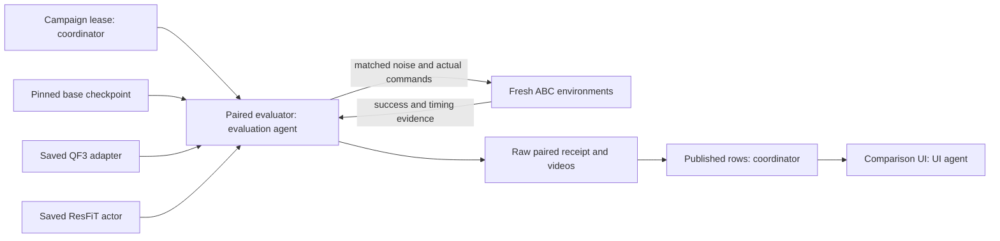

# Matched adaptation pilot

The worker compares one frozen ABC-DiT policy with two saved adaptations.
The adaptations contain four optimizer updates. They are not complete paper trainers.
The task uses the native bimanual YAM robot. No R1 transfer result is produced.

The coordinator must hold the shared GPU campaign lease.
The worker checks that lease before loading the model.
Run the worker through the coordinator's budget controller.
Use an external timeout within the remaining approved budget.

```sh
.venv/bin/python -m abc_bench.paired_eval \
  --checkpoint cache/bottles_75k.pt \
  --qf3-state outputs/bench/qf3-20261007T122826-8a157c/adaptation.pt \
  --resfit-state outputs/bench/resfit-20261007T122854-265cfb/adaptation.pt \
  --output outputs/bench/paired-campaign/paired_eval.json \
  --horizon 1000 --seeds 101,102,103 --device cuda:0
```

## Matched conditions

Each method receives the same three episode seeds.
Each episode starts in a new simulator instance.
The native reset can preserve the previous arm pose. A new instance prevents that carry-over.
The final receipt checks identical initial simulator states across methods.

The worker loads the base checkpoint once.
QF3 enables its saved rank-four output adapter.
The baseline and ResFiT disable that adapter.
ResFiT loads its saved residual actor without optimizer updates.
Its features contain normalized state and mean frozen vision tokens.
Its actor consumes 1550 feature values and 112 nominal action values.
Its hidden layers contain 64 values. Its residual scale is `0.2`.
The action codec uses the checkpoint statistics.
The paired deployment clamps coded residual proposals to `[-0.9999, 0.9999]` before inversion.
This is a new deployment adaptation. The saved update smoke used strict boundary rejection.
The receipt records epsilon `1e-4`, saturation counts, and maximum physical deviation from the nominal proposal.
Non-finite inputs still stop the run.
The interior clamp can alter a nominal proposal even when the learned residual is zero.
Therefore, zero-residual equivalence is not guaranteed when nominal coded values exceed that interior bound.
The clamp limits the inverse transform. It does not establish validated actuator safety limits.

Each proposal receives explicit Gaussian noise from a per-seed NumPy generator.
The generator starts with the same seed for each method.
The noise sequence matches by proposal index. Observations can differ after actions diverge.
The worker executes eight commands per proposal. It does not use prefix conditioning.
All methods use 224-by-224 camera images.
Each action advances 17 physical steps of `0.002` seconds.
The default episode ends at task success or 1000 executed actions.
The coordinator can set `--eval-horizon` to at most 3540 actions.
The paired worker receives the same resolved horizon for all methods.
Its reserved step count is three methods times three seeds times that horizon.
A 2000-action comparison therefore reserves at most 18000 simulator actions.
Longer horizons still require sufficient time in the shared GPU ledger.
The receipt and fidelity label record the resolved horizon.
A longer-horizon run follows inspection of the initial 1000-action pilot.
Treat that run as an exploratory diagnostic, not an untouched held-out evaluation.
Success terminates the episode. The horizon truncates a failed episode.

This baseline differs from an earlier evaluation with a different action cadence or prefix contract.
Compare these three rows with each other under the recorded conditions.
Do not merge them into an unmatched earlier comparison.

## Snapshot provenance

The worker hashes the complete base checkpoint and both adaptation files.
The base hash must match the external campaign runtime manifest.
New snapshots must contain a matching embedded base checkpoint hash.
The two accepted historical snapshots lack that embedded field.
Their accepted artifact hashes and external campaign manifest provide the documented source binding.
No missing embedded field is reported as present.

| Historical snapshot | SHA-256 |
| --- | --- |
| QF3 | `5f9ebf32d4703605d9d852600e477a0bb237b2d64a6585ad4295d8e038f1da56` |
| ResFiT | `6bb9d9be21642175912fc905c31c2510be505ac3f15754a790363bc69e5bdd4b` |

QF3 also requires exact equality between saved and loaded immutable output-layer weights.
Adapter tensor keys, shapes, and finite values must match.
The residual actor must match its documented shape and contain finite weights.
The worker rejects incompatible snapshots before evaluation.

## Metrics and artifacts

Each measured row contains actual success counts, episode counts, and executed steps.
Each world record contains the seed, boundary flags, final task score, and simulation duration.
The mean completion time uses successful episodes only.
It remains unavailable when no episode succeeds.
A separate duration field includes failed episodes that reach the horizon.
Collision and constraint metrics remain absent because this worker does not measure them.

Latency covers the complete action proposal.
ResFiT latency includes its extra frozen feature encoding.
CUDA synchronization brackets each proposal.
The receipt records raw samples and their median and 95th percentile.
Cold calls remain included. This worker does not claim steady-state latency.

The worker saves the first seed's top-camera video for each method.
It samples one frame per eight-action proposal.
Playback uses the corresponding simulated-time rate.
A terminal partial chunk can have a shorter final interval.
Use `--no-video` to omit those artifacts.
Artifact paths are relative to the raw receipt's parent directory.

## Architecture and team roles



The coordinator owns the GPU budget and result publication.
The evaluation agent owns snapshot validation, paired rollouts, and metric scopes.
The algorithm agent owns the adaptation methods.
The reviewer checks implementation and result evidence.
The UI agent shows the measured rows with their limits.

Eight CPU regression tests passed. Both actual historical snapshot schemas passed CPU inspection.
Two regressions check exact boundary deployment decoding and atomic partial evidence.
The worker publishes completed-world evidence after each episode and each completed method.
Partial receipts retain status `partial` and leave paired-state verification false.
A later method failure therefore preserves earlier completed results.
Only the complete final receipt confirms the cross-method initial-state check.
These checks do not establish that a GPU evaluation has run.
The coordinator records separate execution evidence for each measured result.
This explanation uses ASD-STE100 guidance. It has not had a full compliance check.
