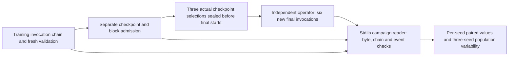

# Proposed full QF3 campaign comparison contract

Status: design for root review. No reader code, final selection, final outcome, launch or source installation is created by this proposal. Worktree `/home/user/aditya/RL/abc-qf3-campaign-comparison`, branch `qf3-campaign-comparison`, base `51f1dfffd721d522b61542b991aa20be69d5ad3c`.

Implement one separate standard-library module `abc_bench.qf3_campaign_comparison`, its focused tests, and its own documentation. Keep the existing `vla_comparison.py`, tests and development contract byte-exact. The new module must not import Torch, NumPy, Sadhana, native ABC policy/simulator modules or a runtime. It reads retained public simulation evidence; it does not read expert annotation payloads, run a policy, select a checkpoint, schedule a job or feed final cases back into training.

The reviewed historical full design is `FULL_CAMPAIGN_DESIGN.json` SHA `9914d6141b71b711be543ea81568810a0e8391aa40fddfb57b91266a261a76da`, with independent design review at `/home/user/aditya/RL/builds/qf3-full-design-review/INDEPENDENT_FULL_CAMPAIGN_DESIGN_REVIEW.json`. Those 0.4.9 inputs are design lineage, not new launch inputs or accepted checkpoints. The new profile uses worker `sadhana.qf3-native-worker/5`, checkpoint envelope 4, block wire `sadhana.qf3-replay-blocks/1`, helper `bbed2a270430f6c82ca41e8170af9879ede4001fad340a82fe0e5b249e080818` and worker `65a62e73c7ad2079c8d6c40262220cb8149323f7f7e7bed8425d2d162645a2c8`. The six math/task/replay/collector/bridge sources retain the accepted exact hashes. Root's version-only 0.4.10 release must supply its real wheel and installed proof. No caller-supplied relaxed source profile is admitted.

## Inputs and independent roles

Use a single pinned JSON campaign request, `schema_version=1`, `kind=qf3_full400k_three_seed_comparison_request`, with exactly three ordered seed entries and one pinned pre-outcome selection seal. The CLI is proposed as `python -m abc_bench.qf3_campaign_comparison --campaign ABS --campaign-sha256 SHA --out ABS`. A missing/incomplete/corrupt input exits nonzero and produces no accepted performance comparison.

Each seed entry pins its training invocation chain, externally accepted selected-checkpoint admission, its checkpoint-selection manifest, and separate frozen/learned final worker and controller receipts. Each training chain entry pins the actual requested/resolved config, worker/controller receipt, used completed resume checkpoint (if any), and an independent checkpoint-admission record for the boundary passed to the next invocation. The first entry must have `resume=null` and start from the pinned shared candidate. Subsequent entries must resume the exact prior accepted complete checkpoint; no calibration `fe4eee6b...`, old source or old warmup/update credit is accepted.

A selection manifest has `schema_version=1`, `kind=qf3_full_campaign_checkpoint_selection`, `status=accepted`, `independent_review=true`, a timezone-aware `selected_at_utc`, actual checkpoint pin, full bridge policy-state hash, base/protocol/continuation/source pins, selected receipt/config/admission pins and an exact counter-only selection rule. The rule is the first accepted completed outer after actual post-warmup training controls reach 400,000, with its fresh validation accepted. The optional combined-accounting diagnostic is not a substitute selection. All three manifests and admissions enter one immutable `qf3_full_campaign_selection_seal` with `sealed_at_utc`, the reserved final cohort/noise/grouping protocol and its exact three selection pins. Require every selection time <= seal time < the earliest controller start of all six final invocations. Require both final invocations for a seed to follow that seed's selection. These externally recorded times establish consistency; hashes are not cryptographic proof of prior existence or access isolation.

Checkpoint admission is a separate trusted evidence boundary, not a boolean inside a worker receipt. Require a pinned `qf3_full_campaign_checkpoint_admission` JSON record with `status=accepted`, `independent_review=true`, the actual admitted checkpoint/config/continuation/base/source and full bridge hash, exact replay identity/counters and canonical replay hash, complete boundary counters, and the exact referenced replay-block pins plus selector-count/hash metadata. Require named accepted checks for model/target/optimizer/RNG state and exact block hydration/row/order/ring semantics. The reader streams the admitted checkpoint and every referenced block to verify byte pins, refuses duplicate/unused block references in admission metadata, and cross-binds all metadata. It cannot deserialize Torch. It must report `tensor_or_replay_semantics_verified_by_reader=false`; row/selector/tensor truth remains the separately accepted audit's scope. Require explicit accepted causal replay/native-dispatch, reward and episode/evidence-ID lineage checks with exact relevant raw tape pins. Full30 proposed labels remain separate from issued prefixes of at most15; admission binds normalized and submitted physical controls, state/next-state, rewards and episode boundaries. Cross-bind those tape pins to the accepted training chain. Occupied final-ring coverage does not prove evicted feature provenance: evicted rows require earlier retained completed-boundary audit coverage. Hydration checks alone prove storage structure, not native training-label truth. The reader never manufactures that audit.

## Training and chain gates

Require the Bottles task and five named bottles under protocol `sadhana.qf3-abc-first-placement/1`. Require the current candidate, normalization, prompt, tokenizer, public native inventory, camera capture 168x224, model pad224, full30/first15/fiveEuler, no added action projection and reviewed runtime dependencies. Pin raw artifact/source/inventory bytes. Within a seed all runtime/base/config identities must match; across seeds require the same candidate/recipe/runtime and declared varied triples `(base,LoRA,worker)=(901,902,903),(1901,1902,1903),(2901,2902,2903)`.

Require storage mode `immutable_replay_blocks`, schema1; 50k replay; 80 worlds x4 complete warmup batches; 16 complete rollout worlds per outer; 1600 critic updates at batch64 and 200 actor updates at batch256 per outer; and the full reviewed explicit learner/target/LoRA/encoder recipe. The final selected boundary must have strict integer K>=1, warmup_batches=4, completed training episodes `320+16*K`, completed_outer, partial=false, pending_validation=null, critic_updates=`1600*K`, actor_updates=`200*K`, target counters consistent with the unchanged schedules, `training_steps>=400000`, and actual `metrics.target_reached=true`. A completed status or max-outer stop below target is refused. The selected accepted history must end at outer K with its exact training_steps and complete fresh50. Every prior accepted outer must be below400000 controls; the immediately preceding outer (or zero training controls for K1) is strictly below target. Reject later target-qualified checkpoints selected after an earlier accepted target crossing. The actual additional400k convention is a declared reconstruction because author warmup inclusion remains unresolved.

Recompute each continuation ID with the exact published worker hash/config formula using the pinned source map, without importing its module. Stage, resume path and watchdog may change only in the ways excluded by that formula; semantic recipe/source/storage changes refuse. Cross-check parent worker/config/source pins, task, seeds and runtime metadata. Require predecessor selected bytes, boundary/counter/state identity and successor resume bytes to agree. Warmup and outer indices may neither skip nor repeat in the accepted chain. For each invocation independently reconcile accepted checkpoint-to-checkpoint warmup/train/control/episode/update/target deltas with uniquely new complete tape/update records. Invocation-only phase counts and the controller metrics must bind the same raw receipt. Repeated inherited totals cannot count as new work. Incomplete discarded attempts remain separate; independent admission must explicitly reconcile their attempted counts against accepted deltas, with all losses/refusals preserved. No accepted-state counter jump without the corresponding new evidence is allowed. Later inherited histories must be exact extensions of accepted prior histories; retain interrupted/failed/partial attempt pins and costs as separate evidence, never count their outcomes as accepted performance or their discarded counters as new checkpoint credit. A failed attempt may supply a complete boundary only through a separate explicit accepted admission and preserved receipt; raw failure does not self-admit.

For every accepted outer1..K require a newly completed learned periodic fresh50 event at that update boundary. Require cursor0..K-1, unique exact manifest pins, source/continuation/base/policy-state binding, crossed threshold `[outer]`, and x-axis equal to cumulative actual training controls. Requested seeds for seed index i/event k/world j are `2**40+i*2**39+(50*k+j)*200001`; actual seeds equal requested or the single permitted +100000 fallback. Noise seed is `(2**45+17+i*1000000)+k+1`. Bind manifest `noise_rng` bytes to independent admission metadata; do not regenerate Gaussian tensors. Verify exact reset files, five bottle/bin poses/scales metadata hashes, no accepted duplicate geometry, actual seed/world/decision order, tape events and complete50 summary, preserved learner/replay/wrapper RNG hashes, accepted cursor and pending-null state. Reset geometry hashes cover public randomization object/scale metadata, not qpos, pixels or numerical trajectory equivalence.

Accepted warmup/train tape references across the chain must bind four80-world batches and K16-world episodes with horizon1000, actual submitted commands, decision/event lengths and accounting. Check their accepted counters against the checkpoint admission. A repeated artifact link in inherited history is a reference, not new work. Interrupted tapes remain linked and excluded from accepted state credit. Report both `training_steps` and `warmup_steps+training_steps`; report accepted validation, discarded evaluation and invocation-only controls separately. Parent elapsed_seconds is the authoritative invocation wall measure; do not derive a phase-sum ETA or equate controls with physics ticks or GPU hours.

## New final events and matched comparison

The reserved common cohort is exactly `2**50+j*200001`, j0..49. Each seed's frozen and learned jobs use its same declared final sampler seed `2**45+17+i*1000000`, 50-world grouping, microbatch4, task/reset/capture/action/runtime profile and 1000-control horizon. Frozen: one reference head, resume=null, zero optimizer counters. Learned: one online learned head, actual selected complete resume pin, verified restore and exact `1600*K`/`200*K` counters. Its continuation must match training; frozen may remove fresh layout sampling and change heads, so its separate identity must be recomputed and its allowed difference checked explicitly.

For learned final require a separate pinned independently accepted qf3_learned_final_preservation_admission. It binds the exact final worker/config/controller receipts, selected resume checkpoint and its independent training admission, pre/post-evaluation saved state/checkpoint pins, full learner/replay/bridge/RNG preservation hashes, and explicit accepted checkpoint-content/preservation checks. Stream its binary refs; the reader does not deserialize tensors and cannot treat equal worker-reported hashes alone as independent proof. For both heads require a standalone completed `stage=evaluate` worker, exactly one new `invocation_evaluation_events` event, `reason=final`, and its newly retained tape. Inherited baseline/history, a periodic event, stale complete summary, partial head set, partial50, duplicate/missing world, wrong actual seed or wrong controller/config pin refuses. Require all50 new complete episodes, exact actual episode/control/tick counts and unchanged training-state before/after. Bind parent start/config/worker hash and metadata to each new event and the global pre-outcome seal. No warmup/train/update calls may occur in a standalone evaluation.

Recompute outcomes from retained per-decision events rather than trusting aggregate success: chronological step/decision order, strict boolean initial predicates, ever_placed starting at five false values regardless of initial predicates, exact first-placement transitions/rewards only after executed steps, termination at five-ever-placed or1000, native-current judge at that history-defined end, tracker/world summaries, physical tape dimensions/finite commands and compiled no-projection profile. Pair exact requested AND actual seeds in order; if fallback differs between policies, refuse the matched comparison rather than silently re-pair. Source/reset matching does not prove equal physical geometry. Reset-time initial placements grant no reward or termination; the first executed step can credit an initially placed object if it is then observed placed. Initial_mask is retained evidence, not initial rewarded history. Current final tapes retain actual reset seeds but no fresh geometry files or raw noise draws; mark these limitations. Bind configured sampler seed, source-defined PCG64 sampling/grouping and retained state-preservation evidence, not an independently regenerated actual-noise claim.

Per seed report both judges, policy success counts/rates, wins/losses/both/neither, successful-only lengths, failure-inclusive lengths, and common-success paired length deltas. Empty successful sets have null mean. Native-current lengths are history-episode end lengths, not native first-success time. Across exactly three seeds report arithmetic mean and explicit population std (`sqrt(sum((x-mean)^2)/3)`) of rates and paired rate differences. For successful-only or common-success length metrics, report defined-seed count; publish three-seed mean/std only if all three seed means exist, otherwise null. Do not collapse150 worlds into independent training trials, impute missing means, infer a speed gain from different successful subsets, publish p-values or claim causal gain/author reproduction.

## Byte handling, costs and acceptance

Hash the exact raw JSON bytes that are parsed. Refuse duplicate keys, NaN/infinity, bool-as-int counters/seeds, malformed SHA/paths, conflicting pins and mutation during reads. Stream binary hashes with a bounded buffer and no tensor load; do not trust a stat-only hash cache. Verify referenced wheel/source/inventory/base/stat/tokenizer/checkpoint/block bytes, and list their exact pins in the derived report. Read one retained simulation JSON tape at a time; input JSON decode memory is still proportional to that tape. There is no new GPU or training cost. Binary verification reads the actual8.8GB candidate and checkpoint/blocks, potentially repeatedly; full campaign CPU I/O/runtime/peak remain unmeasured. No storage saving, capacity reserve, pruning, estimate-as-measurement or changed raw evidence is claimed.

Meaningful CPU synthetic fixtures must cover three complete pairs with K varied and K>25, target-unreached completion, both account axes, full warmup/K1600/K200/freshK accounting, chunked completed-boundary resume, pending retry and discarded attempts, strict predecessor corruption, pre-outcome seal after/between finals, stale inherited frozen/learned events, partial/reordered/missing50, integer-valued-float corruption, both judges and empty successes, mismatched actual fallback/noise/config/source/base/grouping/capture, wrong block/admission pins, byte mutation and atomic output. Prove no heavy imports and wheel/installed CLI behavior. Run all benchmark CPU tests, Ruff, independent source review and pinned OpenQodex before publication. Actual full data do not yet exist; synthetic acceptance is software proof only.

Root owns training, resource admission and immutable release. A separate reviewer owns checkpoint tensor/block acceptance. The independent evaluator owns the final cohort and selections. The reader owner implements these checks; a separate code reviewer accepts them. Preserve old development behavior. Freeze selection before final runs. Retain incomplete evidence. Report unavailable values as unavailable. This explanation follows STE guidance without a full ASD-STE100 compliance claim.
