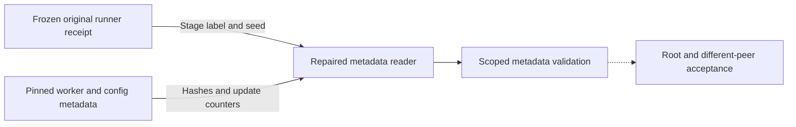

# Frozen QF3 controller receipt compatibility

The frozen original runner emits `QF3 ABC-VLA <stage>` as its receipt algorithm, at runner.py:494. It emits a null controller seed for evaluate and the configured seed for train, at runner.py:507. The repaired campaign reader checks these producer values directly. It keeps the configured policy seed and all receipt hashes, stages, statuses, elapsed times and metric comparisons strict. It rejects running controller receipts.

The first actual seed0 gate error was `controller algorithm differs`. The installed lightweight reader now accepts the exact terminal seed0 parent and verifies41600 critic/5200 actor update rows with no discarded updates. This verifies these metadata gates only. It does not grant full campaign, final evaluation or performance acceptance. No original receipt or native runtime changed.

Tests use producer-shaped train/evaluate receipts. They reject a bare CLI algorithm, wrong algorithm/stage, wrong controller seed and running status. The inherited full reader module suite passes102 cases. Implementation evidence and exact commands are in `/home/user/aditya/RL/builds/qf3-controller-label-repair-20261009/README.md`.

The agent repairs the consumer. The reviewer checks the producer contract. Root accepts and publishes the change. Solid arrows show verified metadata work. The dashed arrow shows pending acceptance. This text uses STE guidance. Full compliance was not checked.
