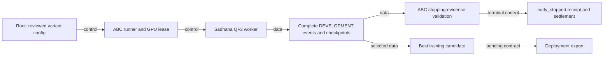

ABC supports the user-requested QF3 development stopping variant. The worker configuration defines the rule. The real coordinator validates the terminal evidence.

Run the usual `qf3-vla` route with `--training-config`. Add the `early_stopping` block documented in Sadhana's `harness/docs/QF3_EARLY_STOPPING.md`. Use the reviewed matching worker wheel. The current wheel uses NRH0.4.16. Do not install it into an active training prefix.

The coordinator reports `early_stopped` after three complete learned checks without improvement. This status differs from a budget stop or full-target completion. `training_target_reached` remains the actual worker value. Success benchmark fields remain unavailable on training receipts.

The coordinator checks the named DEVELOPMENT profile, warmup, positive actor updates, score history and ordered reset identities. It checks the accepted event pins and selected/latest checkpoint hashes. The existing GPU0 lease, finite watchdog and settlement stay in use. No new GPU operation occurs in the CPU tests.

The best checkpoint is a training policy candidate. Existing QF3 export requires the full-target legacy contract. Early-stop export is pending. CPU tests prove software behavior on explicit doubles. They do not prove native task performance.

The builder changes the worker and coordinator. The independent peer verifies the frozen change. Root owns native runs and publication. OpenQodex and Jev support review before a push. This text uses STE guidance. It has no full compliance check.
# Release binding

The new visual evaluator reader requires NRH `0.4.16` exactly. It retains complete source, package RECORD, interpreter and startup checks. Earlier installed readers and workers remain separate. The stopping variant cannot enter the existing full-target QF3 deployment export.

