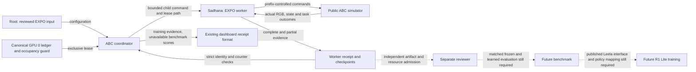

# EXPO-FT coordinator route

The `realtime-expoft-abc` route starts the named ABC/Torch training port. It uses the shared GPU 0 lease and budget ledger. It preserves the released ABC task and candidate artifacts.

The worker has a causal prefix queue, dense camera replay and six optimizer groups. It is separate from the older EXPO candidate-selection mechanism. Training receipts do not establish paper reproduction or task performance.

Use a reviewed worker release in a separate runtime. Keep the active QF3 runtime unchanged. The current diagnostic wheel retains old `0.4.10` metadata. Do not deploy that wheel. Root must assign and verify a new release.

The native coordinator must resolve the same campaign directory as the worker lease. In an isolated checkout, connect `outputs/bench` to the canonical campaign directory before deployment. This connection has not been made by this change. Verify its resolved path and lock inode. Install the new worker in that checkout's `.venv`. Verify the installed package and native inventory before a GPU launch.

Run this command only after those deployment checks and after the previous GPU job has exited:

```sh
python -m abc_bench.runner \
  --algorithm realtime-expoft-abc \
  --checkpoint /home/user/aditya/RL/abc/cache/vla_abc130k_200000_v2.pt \
  --training-config ABSOLUTE_REVIEWED_EXPO_INPUT_JSON \
  --results /home/user/aditya/RL/abc/outputs/bench \
  --timeout-seconds BOUNDED_PARENT_SECONDS
```

The capitalized arguments are placeholders. No new native run is claimed here. Root owns GPU launches. The existing nonblocking lock refuses concurrent launch attempts.

The coordinator forwards the worker's exact configuration. It reduces the child watchdog to retain the existing 60-second parent allowance. It passes the canonical lease directory. Optional `--expoft-resume-pin` identifies a reviewed worker continuation pin. The worker validates that pin. Native world state is not restored.

The parent publishes `phase=training`. It does not publish training success as a benchmark score. `episode_schedule_completed` means the configured episodes ended at a complete update boundary. A missing successful imitation sample remains `awaiting_success_imitation_data`.

| Evidence | Meaning |
| --- | --- |
| `simulation_steps` | Physical submissions during this invocation, including partial attempts. |
| `accepted_completed_control_steps` | Invocation controls from complete accepted episodes, including warmup. |
| `discarded_partial_control_steps` | Invocation controls outside those complete episodes. |
| `updates` | Newly accepted full learner update calls. It does not mean inner critic minibatches. |
| `cumulative_accepted_update_calls` | Accepted calls including the resumed prefix. |
| `completed_training_episodes` | Newly completed episodes; this is not an evaluation cohort. |
| `successes`, `episodes`, latency percentiles | Unavailable as benchmark measurements in this route. |

Control counts must reconcile. Counters use nonnegative integers. Boolean aliases fail. Input identity uses exact JSON types. Repeated update ordinals fail.

The parent retains `training/receipt.json` on worker failure. It records its checksum and error. Invalid worker counters receive no credit. A budget stop or strict-clock miss publishes `status=partial`. A failed process publishes `status=failed`.

The CPU suite checks orchestration with explicit doubles. It checks the shared reservation, settlement, watchdog, UUID forwarding, continuation argument and failure receipts. It does not construct a learner or use a GPU. The initial focused suite passed 33 tests. The full benchmark suite passed 251 tests in 16.99 seconds. Installed runtime, native learning, storage capacity and matched evaluation remain separate gates.



Root owns orchestration and GPU execution. Sadhana owns the queue, replay, visual learner and continuation state. The reviewer checks the method and evidence. Leela owns its published R1 Lite simulation interface.

This explanation uses STE guidance. It has not had a full ASD-STE100 compliance check. Solid arrows describe the implemented software path; native execution and future acceptance remain unverified.
