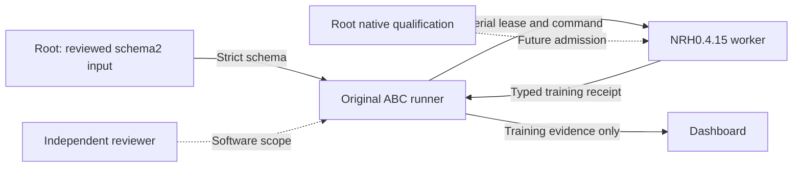

# Visual ResFiT storage coordinator candidate

The existing `resfit-abc-vla` route accepts explicit training input schema2. It reuses the original runner, transport, lease, and counter validation. It adds no parallel dispatch or simulator interface.

Required storage settings:

```json
{"storage":{"rgb_codec":"lossless_rgb_zlib/1","complete_milestone_controls":10000}}
```

The value 10000 must be an integer. Float aliases and different fields fail. Schema1 remains accepted with its original fields and behavior. Other native recipe requirements, including capacity200000, remain unchanged. Never add storage fields silently to an accepted source-pinned input. Prepare and review a new explicit input.

NRH0.4.15 stores lossless compressed immutable episode RGB. It publishes every completed episode and update journal. It saves complete ready milestones, first target-ready, stopped pending debt, resumed ready, and complete invocation boundaries. Matching save reasons share one snapshot. Created artifacts remain retained.

An interrupted open episode retains partial evidence. Its unsaved learner work cannot become restored complete credit. `rollback_controls` counts wrapper/replay controls since the latest snapshot. Physical returns and capture failures have separate counters. Native physics is not restored. Raw blocks remain decodable, but source pins still refuse silent cross-release continuation.

Source review passed 13 peer checks. Owner fixture checks and offline package byte proofs passed. The package proof used cached NumPy2.5.3 only. It does not qualify the required native NumPy2.2.6 stack. No native compression ratio, storage fit, task performance, or launch permission is established.

Verified standalone coordinator check:

```sh
ulimit -c 0
ulimit -v 16777216
ulimit -t 60
CUDA_VISIBLE_DEVICES='' HF_HUB_OFFLINE=1 OMP_NUM_THREADS=1 OPENBLAS_NUM_THREADS=1 MKL_NUM_THREADS=1 PYTHONPATH=/home/user/aditya/RL/abc-resfit-storage-v2 taskset -c 1 timeout 90 /home/user/aditya/RL/abc/.venv/bin/python -m pytest /home/user/aditya/RL/abc-resfit-storage-v2/tests/bench/test_resfit_dispatch.py::test_storage_milestone_type_coordinator -q
```

See the [NRH release runbook](/home/user/aditya/RL/sadhana-resfit-storage-v2/harness/docs/RESFIT_STORAGE_0_4_15.md), [owner handoff](/home/user/aditya/RL/builds/resfit-native-storage-implementation-20261009/OWNER_HANDOFF.json), and [package proof](/home/user/aditya/RL/builds/resfit-storage-0.4.15-package-20261009/PACKAGE_PROOF.json).

Root must admit the isolated native runtime, exact ABC module paths, NumPy2.2.6, canonical campaign output and lock, and source-pinned configs. Measure model/Adam snapshot bytes, RGB compression and latency, retained storage, temporaries, ready/pending restore, and trusted export. Use only serial launches through the original runner. Preserve the live QF3 runtime. The accepted schema1 preparation packet is unchanged.



The coordinator transports reviewed inputs and checks counters. Sadhana owns storage and learner state. The reviewer checks code and fixtures. Root owns native admission and launches. Training receipts do not establish benchmark scores. This explanation follows STE guidance. Full ASD-STE100 compliance was not checked.
