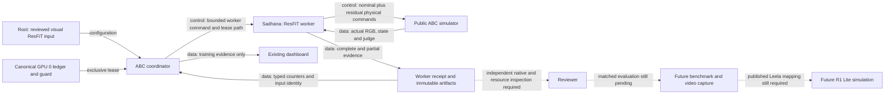

# Visual ResFiT coordinator route

The `resfit-abc-vla` route starts the proper visual ResFiT worker.
It uses the shared GPU 0 lease, occupancy guard and budget ledger.
The worker has three trainable visual encoders.
It learns a residual for each returned physical control.
The frozen nominal policy proposes 30 controls and executes the first 15.
The named profile uses paper MSE and an unprojected residual sum.
It uses online data. No expert demonstrations are asserted.

This route is separate from `sustained-resfit` and the earlier frozen-feature pilot.
It does not replace missing evaluation results with training scores.
The native recipe requires replay capacity 200000 and batch size 256.
It has 10000 warmup controls and 10000 critic warmup updates.
Each later control creates four ordinary critic updates.
Each fourth ordinary critic update also updates the actor.
The coordinator rejects fixture recipes and reduced replay capacity.

Use a separately reviewed worker release and isolated native runtime.
Keep the active QF3 source and runtime unchanged.
Connect this checkout's `outputs/bench` to the canonical campaign directory.
Verify its resolved path and lock inode before deployment.
Install and verify the reviewed release in this checkout's `.venv`.
Check native inventory, model memory, RGB archive growth and checkpoint costs.
Do not deploy a diagnostic wheel with old release metadata.
These native deployment and resource checks remain pending.

Run the command only after those checks and the current GPU job exits:

The worker uses `artifacts.checkpoint_path` from the reviewed training configuration.
The `--checkpoint` option applies to legacy routes and is unused for visual ResFiT and EXPO.
These two routes do not require the legacy `cache/bottles_75k.pt` file.

```sh
python -m abc_bench.runner \
  --algorithm resfit-abc-vla \
  --training-config ABSOLUTE_REVIEWED_RESFIT_INPUT_JSON \
  --results /home/user/aditya/RL/abc/outputs/bench \
  --timeout-seconds BOUNDED_PARENT_SECONDS
```

The capitalized arguments are placeholders.
Root owns all native launches.
The command preserves the complete worker input schema.
It only reduces `max_wall_s` to preserve the parent watchdog allowance.
The worker validates its source and artifact identities before learning.
The native factory requires the live coordinator lease before model construction.

For continuation, use `--resfit-resume-pin PIN_JSON`.
That file contains the raw `.artifact` pin from `latest_complete.json`.
Keep cumulative target, seed, profile, sources and capacity fixed.
The worker permits only the invocation wall budget to change.
Continuation restores owned learner, replay and wrapper state.
It starts a new reset episode. It does not restore native physics.

The parent publishes `phase=training`.
Exit 0 means the cumulative target ended at a complete, debt-cleared episode boundary.
Exit 2 means a valid budget or episode-limit stop.
The parent records that outcome as partial.
Fatal exits retain the worker's error receipt and checksum.
Status and exit mismatches receive no counter credit.
All paths settle the actual parent wall charge in the existing ledger.

| Field | Scope |
| --- | --- |
| `simulation_steps` | Known returned physical controls during this invocation. |
| `accepted_complete_control_steps` | Controls in newly completed episodes. |
| `discarded_partial_control_steps` | Known returned controls outside that completed prefix. |
| `validated_replay_rows` | New rows validated by the worker, including partial episodes. |
| `warmup_physical_control_steps` | Known returned controls before the 10000-row warmup boundary. |
| `learning_physical_control_steps` | Other known returned invocation controls. |
| `ordinary_critic_updates`, `critic_warmup_updates`, `actor_updates` | New wrapper-accounted optimizer operations. These can include partial episode work. |
| `producer_learner_counters` | All reported optimizer operations, including an interrupted group on failure. |
| `native_failed_step_calls_with_unknown_physics` | Failed calls with unknown physics. They do not increase known physical controls. |
| `successes`, `episodes`, latency percentiles | Unavailable as benchmark measurements. |

A returned control can have a missing camera capture.
The worker preserves its physical count without inventing a replay row.
A native step exception can leave the physics count unknown.
The route keeps that count separate.
Dispatch attempts equal known returned controls plus unknown-physics calls.
Warmup and learning physical counts sum to known returned controls.
Accepted complete controls and discarded controls have that same sum.

Validated partial rows can support real optimizer operations.
Those operations remain producer evidence.
Only an independently inspected, pinned complete checkpoint defines resumable software credit.
Raw tapes, update journals and native outcomes still need separate admission.
Neither partial work nor target completion establishes improvement.



Root owns the coordinator and native launches.
Sadhana owns the visual learner, replay, nominal queue and worker.
The independent reviewer checks code and artifact claims.
Leela owns its published R1 Lite simulation interface.
Solid arrows describe the implemented software interfaces.
Native integration and performance remain unverified.
This explanation uses STE guidance.
A full ASD-STE100 compliance check was not performed.
