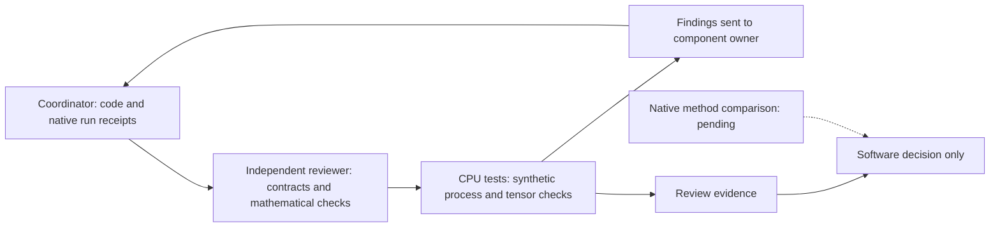

# Independent benchmark review

Date: 2026-10-07. Reviewer: independent-review.

This review covers `abc_bench` and its CPU tests. It does not run GPU jobs,
robot hardware, or another project's training. Native measurements remain
coordinator-owned evidence.

## Review workflow



The coordinator runs native experiments. Algorithm owners implement updates.
The reviewer checks software and evidence claims. Synthetic tests do not measure
robot task performance. This explanation follows STE guidance. Full vocabulary
and grammar compliance was not checked.

## Findings and repairs

- The first runner did not stop child jobs on parent SIGTERM. Keyboard
  cancellation also retained a running receipt. The coordinator added signal
  handling, cancelled receipts, and process-group cleanup.
- A results-specific lock and ledger permitted simultaneous campaigns with
  different results roots. The coordinator moved both to the shared campaign root.
- Initial cleanup waited only for the process leader. A synthetic descendant
  that ignored SIGTERM survived. Cleanup now kills the remaining process group,
  including after normal leader exit. Independent tests reproduce both cases.
- ResFiT initially updated its actor on critic step one. It now updates on even
  critic steps. Target smoothing now operates before residual scaling, preserving
  the bounded correction contract.
- ResFiT's update-smoke receipt originally did not inspect actual gradients.
  The current implementation checks available actor and critic gradients.

## Mathematical and scientific scope

The QF3 objective follows the coordinate-wise velocity clipping expression.
Its reverse-time convention matches ABC's flow path. Flow matching remains
active outside the critic-gradient window. Frozen base velocities are detached.
Clipping is a training filter, not an actuator safety guarantee.

The update smoke uses the actual pretrained action head with a final-layer
adapter. This differs from the paper's attention and MLP adapters. Its critic
fits immediate discounted chunk rewards without a future-value bootstrap.
It does not establish a complete QF3 trainer or learning improvement.

The ResFiT component uses frozen features and full-action critics. Its caller
owns episode-aware replay, demonstration mixing, and checkpoint recovery. The
smoke has no demonstration mixture. It corrects an executed prefix as a chunk;
it does not reproduce ResFiT's per-control-step visual residual policy.

Candidate selection is an arithmetic component. It does not implement
Real-Time EXPO-FT's asynchronous prefix conditioning, delayed replay, editor,
noise critic, supervised base updates, or deployment timing.

The dashboard exposes only named artifacts within the resolved results root.
Existing traversal and symlink negatives pass. Missing measurements remain
unavailable. Short baseline runs do not publish task-success denominators.
Static R1 URDF inspection remains `requires_adapter`; it does not validate
control, physics, cameras, or policy transfer.

## Verification status

The refreshed reviewed CPU run passed 34 tests in 6.82 seconds, exit 0:

```sh
CUDA_VISIBLE_DEVICES='' .venv/bin/python -m pytest tests/bench -q
CUDA_VISIBLE_DEVICES='' .venv/bin/python -m ruff check tests/bench/test_cancellation.py
CUDA_VISIBLE_DEVICES='' .venv/bin/python -m ruff format --check tests/bench/test_cancellation.py
```

Both reviewer-file Ruff commands passed, exit 0. Independent cancellation tests cover
timeout, parent SIGTERM, a descendant that ignores SIGTERM, and normal leader
exit. Tests use synthetic CPU processes and clean up their children.
Two additional checks reject an unrelated CUDA parent lease and verify that
the CPU lease guard does not access the campaign ledger. CLI validation precedes
model loading. No GPU job was launched by the reviewer.

Reviewed implementation hashes:

| File | SHA-256 |
| --- | --- |
| `abc_bench/algorithms.py` | `4649b0ba67255c3283f4e9de1a616adaed0e1745481f4ad8c271ba87135d6fb2` |
| `abc_bench/dashboard.py` | `3260ea49b1c8ac6a06de06af94f69a2df2a03e25e17cc46d85faa3c6425eed65` |
| `abc_bench/embodiments.py` | `f844ab18c7c18afd9af7d5db52411d6082dd6d9f7c12674068ac7332ad43bdb2` |
| `abc_bench/runner.py` | `cff8f8034b1a2e00c6a12adf1f2c3f6c33b9ed6c65b2b0e7ee916ee39544533d` |
| `abc_bench/update_smoke.py` | `960f0ef256c525d1b014982773643aa70a1fcd7c7d04fc662931fdc54c6b3501` |
| `tests/bench/test_cancellation.py` | `6b1d6130f7a9fed3bd1fd9a4b9d876de9f8681c51cb9de53f85bebf735db45db` |

Decision: software checks pass at these hashes. No remaining blocking finding
was identified within this scope. The shared budget controller now owns GPU
update workers. This cooperative lease is not operating-system enforcement.
The explicit `ABC_BENCH_REPO` setting selects the authorized checkout when
running an installed package. The worker and coordinator use the same results
root. Do not change that setting to create a separate campaign budget.

Partial recovery counts only explicit completed-world stdout records. It applies
only to benchmark-phase baselines. Unfinished worlds are excluded. Missing
reward and completion time remain unavailable. Its rounded latency scope and
partial status are explicit. The receipt hashes the source log. Two new CPU
regressions verify unfinished-world exclusion and the absence of invented
completed episodes. A partial cohort is not the planned full cohort.

Update smokes now save model and optimizer state in `adaptation.pt`. The snapshot
and receipt pin the base checkpoint content. Completed smoke receipts hash the
snapshot. The stated scope is optimizer-state evidence, not exact continuation.
Replay and environment state are absent. QF3 keeps its immediate-return critic;
the save operation does not turn it into a bootstrapped trainer.

The longer baseline receipt was still running when inspected. GPU update
smokes had no completed receipt yet. Their outcomes remain pending separate
review. The unavailable native EXPO-FT receipt correctly states its missing
ABC bridge. No complete three-method benchmark, learning improvement, or R1
transfer result is accepted by this document. Changed implementation hashes
require renewed verification.
