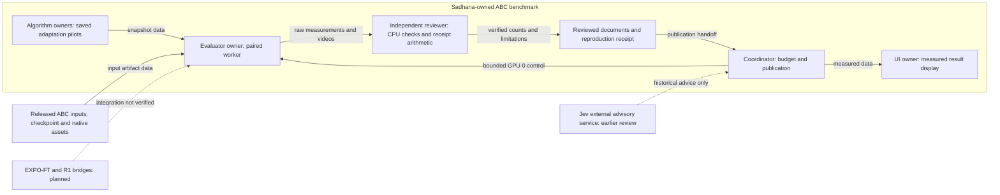

# Independent benchmark review

Date: 2026-10-07. Reviewer: benchmark-final-review.

The completed 1000-action and 2000-action receipts pass independent arithmetic
and artifact checks. The current software passes 47 CPU tests. This accepts a
measured benchmark milestone. The user's full training goal remains active.
Four optimizer updates do not establish convergence or a complete paper reproduction.

This final review reads native run evidence and runs CPU checks. It launches
no GPU job and sends no external request. Earlier sections below preserve
the staged review history. Their pending statements describe the earlier stage.

## Final measurement decision

Both runs use the native bimanual YAM robot and `put_plastic_bottles_in_bin`.
Every method has seeds 101, 102, and 103. One action advances 0.034 seconds.
Each proposal executes up to eight actions. The evaluator creates fresh environments.
Noise matches by proposal index. The policy uses 224-by-224 camera images.

| Horizon | Method | Success | Actions | Proposal p50 / p95 | Successful completion |
| --- | --- | --- | --- | --- | --- |
| 1000 | Frozen baseline | 0 / 3 | 3000 | 420.57 / 481.26 ms | unavailable |
| 1000 | QF3 output adapter | 1 / 3 | 2711 | 418.32 / 473.42 ms | 24.174 s |
| 1000 | ResFiT frozen features | 0 / 3 | 3000 | 537.01 / 622.68 ms | unavailable |
| 2000 | Frozen baseline | 1 / 3 | 4696 | 418.31 / 478.18 ms | 23.664 s |
| 2000 | QF3 output adapter | 0 / 3 | 6000 | 423.48 / 484.05 ms | unavailable |
| 2000 | ResFiT frozen features | 1 / 3 | 5016 | 533.43 / 611.39 ms | 34.544 s |

The reviewer recomputed counts, actions, terminal scores, durations, and latency
percentiles from all 18 world records and raw proposal samples. Child metrics
equal the raw records. Successful completion time excludes failed episodes.
The task score is a terminal score. It is not a summed training return.

The 1000-action run executes 8711 actions. Its worker time is 683.1372 seconds.
Its coordinator time is 685.8922 seconds. The 2000-action run executes 15712 actions.
Its worker time is 1171.6010 seconds. Its coordinator time is 1174.3995 seconds.
Coordinator time includes subprocess overhead and supplies the campaign charge.

The 2000-action horizon was selected after the 1000-action results were seen.
It is an exploratory diagnostic. Three trials per method do not establish a
reliable policy gain. Preserve all six results and their horizons.

## Reproduction limits

`qpos` is the simulator's joint and object position vector. The evaluator hashes
its float32 representation. The `paired_initial_states_verified` flag checks
only these bytes across methods. It does not check every model property,
velocity, renderer state, or initial camera image.

The same qpos hashes also occur across the two runs. Seed 101 still changes
outcome before the shorter horizon ends. The baseline fails at 1000 actions
in the first run and succeeds at 696 actions in the second run. QF3 succeeds
at 711 actions in the first run and fails at 2000 actions in the second run.
The cause remains unresolved. These changes do not establish a causal horizon effect.

Fresh CPU resets at both horizons reproduce the recorded qpos hashes for all
three seeds. The exposed model arrays and selected data arrays also match.
Camera rendering is disabled for that check. No GPU observation trace or full
action trace was recorded. The CPU reset check does not prove GPU rollout repeatability.

The final receipt retains ResFiT's declared interior codec limit of `1e-4`.
The 1000-action run reports 59 saturated coordinates. The 2000-action run reports 212.
Maximum physical deviations from nominal commands are 0.5516124 and 0.5580742.
Coordinate units differ across joints and grippers. These numbers do not validate actuator safety.
The limit can change a nominal command with a zero learned residual.

The historical snapshots lack an embedded base checkpoint hash. The accepted
snapshot hashes and external campaign manifest provide their documented binding.
The snapshots contain optimizer state. They lack replay and environment state.
They do not support exact continuation of training.

The 1000-action parent receipt names local HEAD `2af1f80` as `upstream_commit`.
That commit contains no paired evaluator. Its evaluator was uncommitted and has
the recorded source hash `f78df76a0cd3a51bb02d05b38566b0e10d302ba93aed401e5778556123be2be3`.
The old commit alone cannot reconstruct that run. The 2000-action receipt records
separate upstream, harness, dirty-state, and source pins.

The runtime manifest pins package versions and GPU ordinal 0. It omits the
GPU model, GPU UUID, driver version, and a member manifest for downloaded scene assets.
These omissions limit reconstruction on another machine. No bitwise GPU replay is accepted.

Whole-proposal latency includes cold calls and synchronized CUDA. ResFiT includes
its extra feature encoding. Eight actions span 272 ms of simulation. The
reported medians exceed this interval. Deployment deadlines and observation age remain unmeasured.

Real-Time EXPO-FT has no executed ABC training result. R1 Lite and R1 Pro still
require task adapters and compatible checkpoints. Native YAM measurements are not R1 measurements.
Full training, convergence, and embodiment transfer remain pending work.

## Final pins and budget

The accepted upstream revision is `d0832d12651d1b260a652861a14648dc5f3660c7`.
The 2000-action harness revision is `c05afcdaf915dea7d009e2b82f313faac462da4e`.
Its receipt records `harness_dirty=false`. Current benchmark source hashes equal
its seven recorded hashes. Only documentation changes are pending in this review.

| Artifact | Independently verified SHA-256 |
| --- | --- |
| 1000-action raw receipt | `f985fa0e7343d8f28a603288865348db511b815a8d816a8f0d1cac95ae171384` |
| 2000-action raw receipt | `33cb103135c9c852de6d8cdc07d2a386fcf59fb43cf55fe976852c84ab40f046` |
| Complete 8,063,019,342-byte base checkpoint | `c1da365f220ca8482b1dcd35675cdb77c5d1fd1a7e07025d0835e1f3c4556e26` |
| QF3 adaptation | `5f9ebf32d4703605d9d852600e477a0bb237b2d64a6585ad4295d8e038f1da56` |
| ResFiT adaptation | `6bb9d9be21642175912fc905c31c2510be505ac3f15754a790363bc69e5bdd4b` |
| Runtime manifest | `4b0cbb10dc5984cf9bbdd0eb16a17e23e460d2db5bb099e31b9b90e0c58c76d7` |
| Dependency lock | `d0ac9008ba34515bb2a6e81097f613652fbfa04594073899e6979032271a38b1` |

Installed package metadata matches the runtime manifest: PyTorch `2.11.0+cu128`,
MuJoCo `3.8.1`, MuJoCo Warp `3.8.0.3`, Warp `1.13.0`, and Gymnasium `1.4.0`.
All six video artifact links resolve. The receipt also records their content hashes.

The campaign ledger records GPU 0 and a 7200-second limit. Its charged time is
6463.41130446794 seconds. The remaining time is 736.5886955320602 seconds.
The charge equals the sum of non-child run times. Method children add no second charge.
The ledger has no active parent lease. The reviewer leaves it unchanged.

The final CPU rerun passes 47 tests in 7.35 seconds, exit 0. Ruff checks pass.
Ruff format checks pass for 15 files. No benchmark source changed during this review.
Package builds and browser checks remain prior evidence; this reviewer did not rerun them.
Machine-readable checks and limitations are in [reproducibility_review.json](reproducibility_review.json).

## Review workflow



The coordinator owns native experiments and the shared budget. Algorithm owners
own the update methods. The evaluator owner checks snapshots and runs paired trials.
The reviewer checks source contracts, file hashes, CPU behavior, and measurement arithmetic.
The UI owner displays results and unavailable measurements. Jev supplied earlier advisory judgments.
This reviewer did not call Jev. The planned bridges have no verified training handoff.
The workflow uses project-owned code and recorded input artifacts. It uses no
private implementation import from another project. Synthetic tests do not measure robot performance.
This explanation uses ASD-STE100 guidance. Full vocabulary and grammar compliance was not checked.

## Earlier staged review record

## Findings and repairs

- The first runner did not stop child jobs on parent SIGTERM. Keyboard
  cancellation also retained a running receipt. The coordinator added signal
  handling, cancelled receipts, and process-group cleanup.
- A results-specific lock and ledger permitted simultaneous campaigns with
  different results roots. The coordinator moved both to the shared campaign root.
- Initial cleanup waited only for the process leader. A synthetic descendant
  that ignored SIGTERM survived. Cleanup now kills the remaining process group,
  including after normal leader exit. Independent tests reproduce both cases.
- ResFiT initially updated its actor on critic step one. It now updates on even
  critic steps. Target smoothing now operates before residual scaling, preserving
  the bounded correction contract.
- ResFiT's update-smoke receipt originally did not inspect actual gradients.
  The current implementation checks available actor and critic gradients.

## Mathematical and scientific scope

The QF3 objective follows the coordinate-wise velocity clipping expression.
Its reverse-time convention matches ABC's flow path. Flow matching remains
active outside the critic-gradient window. Frozen base velocities are detached.
Clipping is a training filter, not an actuator safety guarantee.

The update smoke uses the actual pretrained action head with a final-layer
adapter. This differs from the paper's attention and MLP adapters. Its critic
fits immediate discounted chunk rewards without a future-value bootstrap.
It does not establish a complete QF3 trainer or learning improvement.

The ResFiT component uses frozen features and full-action critics. Its caller
owns episode-aware replay, demonstration mixing, and checkpoint recovery. The
smoke has no demonstration mixture. It corrects an executed prefix as a chunk;
it does not reproduce ResFiT's per-control-step visual residual policy.

Candidate selection is an arithmetic component. It does not implement
Real-Time EXPO-FT's asynchronous prefix conditioning, delayed replay, editor,
noise critic, supervised base updates, or deployment timing.

The dashboard exposes only named artifacts within the resolved results root.
Existing traversal and symlink negatives pass. Missing measurements remain
unavailable. Short baseline runs do not publish task-success denominators.
Static R1 URDF inspection remains `requires_adapter`; it does not validate
control, physics, cameras, or policy transfer.

## Verification status

The refreshed reviewed CPU run passed 47 tests in 7.00 seconds, exit 0:

```sh
CUDA_VISIBLE_DEVICES='' .venv/bin/python -m pytest tests/bench -q
CUDA_VISIBLE_DEVICES='' .venv/bin/python -m ruff check abc_bench tests/bench
CUDA_VISIBLE_DEVICES='' .venv/bin/python -m ruff format --check abc_bench tests/bench
```

Both Ruff commands passed, exit 0; 15 files were formatted. Independent cancellation tests cover
timeout, parent SIGTERM, a descendant that ignores SIGTERM, and normal leader
exit. Tests use synthetic CPU processes and clean up their children.
Two additional checks reject an unrelated CUDA parent lease and verify that
the CPU lease guard does not access the campaign ledger. CLI validation precedes
model loading. No GPU job was launched by the reviewer.

Reviewed implementation hashes:

| File | SHA-256 |
| --- | --- |
| `abc_bench/algorithms.py` | `4649b0ba67255c3283f4e9de1a616adaed0e1745481f4ad8c271ba87135d6fb2` |
| `abc_bench/dashboard.py` | `8aa394c60c6cd2321432757ae0fc49c25a63e946f570789adec667c80a5240e8` |
| `abc_bench/embodiments.py` | `f844ab18c7c18afd9af7d5db52411d6082dd6d9f7c12674068ac7332ad43bdb2` |
| `abc_bench/runner.py` | `68cacdc7e3af38baa187921602b23337e33e5a5e91288e0e8ad20e100c5f9cd3` |
| `abc_bench/update_smoke.py` | `960f0ef256c525d1b014982773643aa70a1fcd7c7d04fc662931fdc54c6b3501` |
| `abc_bench/paired_eval.py` | `f467136601cb73d2ecc2eb042e941bb171d640b8d26107289478a708e662a3fe` |
| `tests/bench/test_cancellation.py` | `6b1d6130f7a9fed3bd1fd9a4b9d876de9f8681c51cb9de53f85bebf735db45db` |
| `tests/bench/test_paired_review.py` | `4b31257cd70baf5cf630bd8a1f89c6b7a9c61e9172b1606dc56e632812e9c91b` |

Decision: software checks pass at these hashes. No remaining blocking finding
was identified within this scope. The shared budget controller now owns GPU
update workers. This cooperative lease is not operating-system enforcement.
The explicit `ABC_BENCH_REPO` setting selects the authorized checkout when
running an installed package. The worker and coordinator use the same results
root. Do not change that setting to create a separate campaign budget.

Partial recovery counts only explicit completed-world stdout records. It applies
only to benchmark-phase baselines. Unfinished worlds are excluded. Missing
reward and completion time remain unavailable. Its rounded latency scope and
partial status are explicit. The receipt hashes the source log. Two new CPU
regressions verify unfinished-world exclusion and the absence of invented
completed episodes. A partial cohort is not the planned full cohort.

Update smokes now save model and optimizer state in `adaptation.pt`. The snapshot
and receipt pin the base checkpoint content. Completed smoke receipts hash the
snapshot. The stated scope is optimizer-state evidence, not exact continuation.
Replay and environment state are absent. QF3 keeps its immediate-return critic;
the save operation does not turn it into a bootstrapped trainer.

The longer baseline receipt was still running when inspected. GPU update
smokes had no completed receipt yet. Their outcomes remain pending separate
review. The unavailable native EXPO-FT receipt correctly states its missing
ABC bridge. No complete three-method benchmark, learning improvement, or R1
transfer result is accepted by this document. Changed implementation hashes
require renewed verification.

## Paired evaluation and offline export follow-up

Paired evaluation uses fresh environments for every method and seed. It checks
initial qpos hashes across methods, including randomized object poses. Each
method uses the same per-seed Gaussian sequence by proposal index. All methods
execute eight-action prefixes with the same horizon, cameras, and simulator
timing. The baseline is separately measured at this cadence; it is not equated
with the earlier upstream baseline cadence.

Success-only completion time remains distinct from all-episode duration.
Proposal latency includes feature encoding for ResFiT and synchronized CUDA.
Snapshots require source/action contracts, finite compatible tensors, and
unchanged immutable QF3 output-layer weights. Historical snapshots additionally
require the accepted artifact allowlist and external campaign base pin.

The reviewer repaired task forwarding, campaign manifest-root selection,
video-writer failure cleanup, offline artifact links, and inherited single-seed
labels. Comparison children have no invented single seed; they list all three
evaluation seeds. Exported artifact links resolve from the export destination
and are URL-quoted. Export does not copy media files; preserve their relative
layout when moving an export.

Three independent CPU-mock tests verify task and seed metadata, destination
links, and environment closure when video initialization fails. The last test
also proves that the selected campaign root supplies the runtime manifest.
These mocks do not admit a native evaluation. The updated software is accepted
at the hashes above; paired GPU measurements still need receipt review. The
comparison remains a four-update adaptation pilot, not a full-paper benchmark
or a Real-Time EXPO-FT or R1 transfer result. Earlier statements about pending
GPU smoke receipts describe the earlier software review, not their later status.

## Failed comparison and explicit deployment adaptation

The first actual comparison failed in the strict ResFiT inverse codec after
497.5 seconds. Closed-interval learner outputs could reach exactly minus or
plus one, where the inverse tanh is undefined. The historical failed receipt
remains unchanged. Its SHA-256 is
`319dd93686bd88bbcc37ec65908755bf94844ad0edbf5f62087b98c5a9d0e104`.

The retry introduces a paired-evaluation-only interior projection with epsilon
`1e-4`. The original codec and historical smoke still fail closed at boundaries.
The new evaluator records saturated element counts and maximum numeric physical
coordinate deviation from the nominal command. These measurements are not
actuator safety evidence. Coordinate units differ across arms and grippers.

This projection is a new deployment adaptation. It can change even a zero
residual when a valid nominal code exceeds `0.9999` in magnitude. Paired
zero-residual equivalence is therefore not claimed. The retry must have a new
run identity and must disclose this change.

The evaluator now persists completed worlds after each world and method.
Partial records set `paired_initial_states_verified=false`. The final result
sets it true only after the original cross-method initial-state comparison.
Partial evidence cannot establish a verified full matched comparison.

Two new CPU regressions verify finite boundary projection with reported counts,
and retention of completed partial results without a false paired-state claim.
All 44 CPU tests passed at the current hashes. This accepts the retry software
for a new bounded run. It does not accept the pending GPU outcome or convert
the prior failed comparison into success.

## Configurable horizon review

The runner resolves one comparison horizon for the actual command, maximum
action-step count, parent receipt, and child labels. Its default remains 1000.
The declared ceiling is 3540. Step accounting is nine episodes times the
chosen horizon. The shared GPU budget and exclusive lock remain unchanged.

An independent CPU-mock regression checks 1000 and 2000 horizons through the
runner, including command forwarding and child budgets. The worker ceiling
update was held until the 1000-step evaluation ended. It now validates both CLI
and direct-call horizons using the same runner contract. The source was frozen
before the new 2000-step run. That run's outcome remains unverified here.

A longer horizon chosen after viewing 1000-step outcomes is a follow-up
diagnostic. Preserve the earlier outcomes and disclose the changed horizon.
Do not present the new horizon as an untouched final evaluation or extra GPU
authorization. The next run must fit the existing remaining campaign budget.

## Completed 1000-step pilot verification

The independently checked file is
`outputs/bench/comparison-20261007T150104-4ef245/paired_eval.json`.
Its SHA-256 is
`f985fa0e7343d8f28a603288865348db511b815a8d816a8f0d1cac95ae171384`.

| Adaptation pilot | Success | Executed steps | Proposal p50 / p95 |
| --- | --- | --- | --- |
| Frozen matched baseline | 0 / 3 | 3000 | 420.57 / 481.26 ms |
| QF3 output adapter | 1 / 3 | 2711 | 418.32 / 473.42 ms |
| ResFiT frozen features | 0 / 3 | 3000 | 537.01 / 622.68 ms |

The reviewer recomputed every metric from the nine world records and stored
proposal latencies. Seeds are exactly 101, 102, and 103 for each method.
Initial qpos hashes match by seed. Simulator durations equal executed steps
times 0.034 seconds. The total is 8711 steps. The base checkpoint, both
adaptation artifacts, and runtime manifest match their recorded content hashes.
Child receipts correctly contain no invented single seed.

The actual 1000-step worker used the previous paired source hash
`f78df76a0cd3a51bb02d05b38566b0e10d302ba93aed401e5778556123be2be3`.
The ceiling extension was applied after it exited. The newer source hash in
the table applies to the subsequent run, not retrospectively to this pilot.

Decision: accept these counts and latency measurements as an exploratory
matched pilot. Preserve both negative results. One success in three trials
does not establish a reliable policy gain. No deployed real-time, complete
paper reproduction, or R1 transfer conclusion follows.

## Revision field correction

Older receipts used `git rev-parse HEAD` for `upstream_commit`. That value was
the benchmark fork's HEAD, not the original ABC upstream revision. Existing
receipts were preserved. Future receipts read `upstream_commit` from the pinned
campaign manifest and record separate `harness_commit`, `harness_dirty`, source
file hashes, and manifest hash. The accepted ABC upstream pin is
`d0832d12651d1b260a652861a14648dc5f3660c7`.

The independent runner regression checks that the upstream pin differs from
the synthetic harness revision and that the actual runner source is hashed.
The completed 1000-step receipt predates this correction. Its older field must
be interpreted using this explanation. The 2000-step follow-up uses the new
provenance fields; its results remain pending separate verification.
