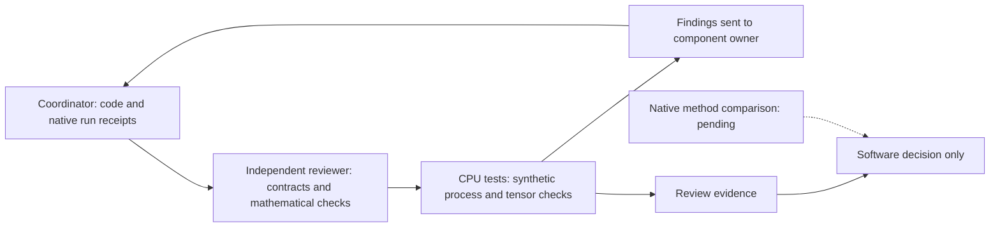

# Independent benchmark review

Date: 2026-10-07. Reviewer: independent-review.

This review covers `abc_bench` and its CPU tests. It does not run GPU jobs,
robot hardware, or another project's training. Native measurements remain
coordinator-owned evidence.

## Review workflow



The coordinator runs native experiments. Algorithm owners implement updates.
The reviewer checks software and evidence claims. Synthetic tests do not measure
robot task performance. This explanation follows STE guidance. Full vocabulary
and grammar compliance was not checked.

## Findings and repairs

- The first runner did not stop child jobs on parent SIGTERM. Keyboard
  cancellation also retained a running receipt. The coordinator added signal
  handling, cancelled receipts, and process-group cleanup.
- A results-specific lock and ledger permitted simultaneous campaigns with
  different results roots. The coordinator moved both to the shared campaign root.
- Initial cleanup waited only for the process leader. A synthetic descendant
  that ignored SIGTERM survived. Cleanup now kills the remaining process group,
  including after normal leader exit. Independent tests reproduce both cases.
- ResFiT initially updated its actor on critic step one. It now updates on even
  critic steps. Target smoothing now operates before residual scaling, preserving
  the bounded correction contract.
- ResFiT's update-smoke receipt originally did not inspect actual gradients.
  The current implementation checks available actor and critic gradients.

## Mathematical and scientific scope

The QF3 objective follows the coordinate-wise velocity clipping expression.
Its reverse-time convention matches ABC's flow path. Flow matching remains
active outside the critic-gradient window. Frozen base velocities are detached.
Clipping is a training filter, not an actuator safety guarantee.

The update smoke uses the actual pretrained action head with a final-layer
adapter. This differs from the paper's attention and MLP adapters. Its critic
fits immediate discounted chunk rewards without a future-value bootstrap.
It does not establish a complete QF3 trainer or learning improvement.

The ResFiT component uses frozen features and full-action critics. Its caller
owns episode-aware replay, demonstration mixing, and checkpoint recovery. The
smoke has no demonstration mixture. It corrects an executed prefix as a chunk;
it does not reproduce ResFiT's per-control-step visual residual policy.

Candidate selection is an arithmetic component. It does not implement
Real-Time EXPO-FT's asynchronous prefix conditioning, delayed replay, editor,
noise critic, supervised base updates, or deployment timing.

The dashboard exposes only named artifacts within the resolved results root.
Existing traversal and symlink negatives pass. Missing measurements remain
unavailable. Short baseline runs do not publish task-success denominators.
Static R1 URDF inspection remains `requires_adapter`; it does not validate
control, physics, cameras, or policy transfer.

## Verification status

The refreshed reviewed CPU run passed 46 tests in 8.48 seconds, exit 0:

```sh
CUDA_VISIBLE_DEVICES='' .venv/bin/python -m pytest tests/bench -q
CUDA_VISIBLE_DEVICES='' .venv/bin/python -m ruff check abc_bench tests/bench
CUDA_VISIBLE_DEVICES='' .venv/bin/python -m ruff format --check abc_bench tests/bench
```

Both Ruff commands passed, exit 0; 15 files were formatted. Independent cancellation tests cover
timeout, parent SIGTERM, a descendant that ignores SIGTERM, and normal leader
exit. Tests use synthetic CPU processes and clean up their children.
Two additional checks reject an unrelated CUDA parent lease and verify that
the CPU lease guard does not access the campaign ledger. CLI validation precedes
model loading. No GPU job was launched by the reviewer.

Reviewed implementation hashes:

| File | SHA-256 |
| --- | --- |
| `abc_bench/algorithms.py` | `4649b0ba67255c3283f4e9de1a616adaed0e1745481f4ad8c271ba87135d6fb2` |
| `abc_bench/dashboard.py` | `8aa394c60c6cd2321432757ae0fc49c25a63e946f570789adec667c80a5240e8` |
| `abc_bench/embodiments.py` | `f844ab18c7c18afd9af7d5db52411d6082dd6d9f7c12674068ac7332ad43bdb2` |
| `abc_bench/runner.py` | `af2d9de69c350e94ab2a3a88d665a3f673a283d3205ac896be700a1a64bbfbb0` |
| `abc_bench/update_smoke.py` | `960f0ef256c525d1b014982773643aa70a1fcd7c7d04fc662931fdc54c6b3501` |
| `abc_bench/paired_eval.py` | `f78df76a0cd3a51bb02d05b38566b0e10d302ba93aed401e5778556123be2be3` |
| `tests/bench/test_cancellation.py` | `6b1d6130f7a9fed3bd1fd9a4b9d876de9f8681c51cb9de53f85bebf735db45db` |
| `tests/bench/test_paired_review.py` | `224682e9597a5e8337380655c3f6f955830d0d24e6a3b193e5698e26c46691f9` |

Decision: software checks pass at these hashes. No remaining blocking finding
was identified within this scope. The shared budget controller now owns GPU
update workers. This cooperative lease is not operating-system enforcement.
The explicit `ABC_BENCH_REPO` setting selects the authorized checkout when
running an installed package. The worker and coordinator use the same results
root. Do not change that setting to create a separate campaign budget.

Partial recovery counts only explicit completed-world stdout records. It applies
only to benchmark-phase baselines. Unfinished worlds are excluded. Missing
reward and completion time remain unavailable. Its rounded latency scope and
partial status are explicit. The receipt hashes the source log. Two new CPU
regressions verify unfinished-world exclusion and the absence of invented
completed episodes. A partial cohort is not the planned full cohort.

Update smokes now save model and optimizer state in `adaptation.pt`. The snapshot
and receipt pin the base checkpoint content. Completed smoke receipts hash the
snapshot. The stated scope is optimizer-state evidence, not exact continuation.
Replay and environment state are absent. QF3 keeps its immediate-return critic;
the save operation does not turn it into a bootstrapped trainer.

The longer baseline receipt was still running when inspected. GPU update
smokes had no completed receipt yet. Their outcomes remain pending separate
review. The unavailable native EXPO-FT receipt correctly states its missing
ABC bridge. No complete three-method benchmark, learning improvement, or R1
transfer result is accepted by this document. Changed implementation hashes
require renewed verification.

## Paired evaluation and offline export follow-up

Paired evaluation uses fresh environments for every method and seed. It checks
initial qpos hashes across methods, including randomized object poses. Each
method uses the same per-seed Gaussian sequence by proposal index. All methods
execute eight-action prefixes with the same horizon, cameras, and simulator
timing. The baseline is separately measured at this cadence; it is not equated
with the earlier upstream baseline cadence.

Success-only completion time remains distinct from all-episode duration.
Proposal latency includes feature encoding for ResFiT and synchronized CUDA.
Snapshots require source/action contracts, finite compatible tensors, and
unchanged immutable QF3 output-layer weights. Historical snapshots additionally
require the accepted artifact allowlist and external campaign base pin.

The reviewer repaired task forwarding, campaign manifest-root selection,
video-writer failure cleanup, offline artifact links, and inherited single-seed
labels. Comparison children have no invented single seed; they list all three
evaluation seeds. Exported artifact links resolve from the export destination
and are URL-quoted. Export does not copy media files; preserve their relative
layout when moving an export.

Three independent CPU-mock tests verify task and seed metadata, destination
links, and environment closure when video initialization fails. The last test
also proves that the selected campaign root supplies the runtime manifest.
These mocks do not admit a native evaluation. The updated software is accepted
at the hashes above; paired GPU measurements still need receipt review. The
comparison remains a four-update adaptation pilot, not a full-paper benchmark
or a Real-Time EXPO-FT or R1 transfer result. Earlier statements about pending
GPU smoke receipts describe the earlier software review, not their later status.

## Failed comparison and explicit deployment adaptation

The first actual comparison failed in the strict ResFiT inverse codec after
497.5 seconds. Closed-interval learner outputs could reach exactly minus or
plus one, where the inverse tanh is undefined. The historical failed receipt
remains unchanged. Its SHA-256 is
`319dd93686bd88bbcc37ec65908755bf94844ad0edbf5f62087b98c5a9d0e104`.

The retry introduces a paired-evaluation-only interior projection with epsilon
`1e-4`. The original codec and historical smoke still fail closed at boundaries.
The new evaluator records saturated element counts and maximum numeric physical
coordinate deviation from the nominal command. These measurements are not
actuator safety evidence. Coordinate units differ across arms and grippers.

This projection is a new deployment adaptation. It can change even a zero
residual when a valid nominal code exceeds `0.9999` in magnitude. Paired
zero-residual equivalence is therefore not claimed. The retry must have a new
run identity and must disclose this change.

The evaluator now persists completed worlds after each world and method.
Partial records set `paired_initial_states_verified=false`. The final result
sets it true only after the original cross-method initial-state comparison.
Partial evidence cannot establish a verified full matched comparison.

Two new CPU regressions verify finite boundary projection with reported counts,
and retention of completed partial results without a false paired-state claim.
All 44 CPU tests passed at the current hashes. This accepts the retry software
for a new bounded run. It does not accept the pending GPU outcome or convert
the prior failed comparison into success.

## Configurable horizon review

The runner resolves one comparison horizon for the actual command, maximum
action-step count, parent receipt, and child labels. Its default remains 1000.
The declared ceiling is 3540. Step accounting is nine episodes times the
chosen horizon. The shared GPU budget and exclusive lock remain unchanged.

An independent CPU-mock regression checks 1000 and 2000 horizons through the
runner, including command forwarding and child budgets. The active worker
source remains unchanged. Its CLI ceiling update is deliberately held until
the active 1000-step evaluation ends. A 2000-step end-to-end run is not yet
accepted by this intermediate review.

A longer horizon chosen after viewing 1000-step outcomes is a follow-up
diagnostic. Preserve the earlier outcomes and disclose the changed horizon.
Do not present the new horizon as an untouched final evaluation or extra GPU
authorization. The next run must fit the existing remaining campaign budget.
