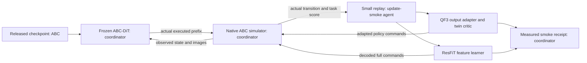

# Actual-policy update smoke

This command checks optimizer execution with a released ABC-DiT checkpoint.
It collects real simulator transitions through the public Gymnasium interface.
It is an update smoke test. It does not measure converged method performance.

Run only through the coordinator's one-GPU budget controller.
Set an external process timeout of 600 seconds or less.
The internal deadline also checks collection, update, and evaluation loops.
Model loading and individual library calls require the external timeout.

```sh
.venv/bin/python -m abc_bench.runner --algorithm qf3 --timeout-seconds 600
```

Use `--algorithm resfit` for the residual learner.
The coordinator creates a unique run directory and dashboard receipt.
The defaults collect four chunks with eight executed actions each.
Four updates precede two post-update chunks.
The checkpoint predicts 30 actions. Replay stores only the executed eight-action prefix.
No missing suffix becomes a training target or critic input.
An unexpected episode boundary stops the run with an error.
No success value is fabricated from incomplete collection.

## QF3 adaptation

A rank-four adapter wraps the final ABC-DiT linear output layer.
The adapter starts at zero. All original parameters remain frozen.
The critic uses frozen normalized state and mean vision tokens.
Two small critics fit actual discounted immediate chunk returns.
This diagnostic critic does not use future-Q bootstrapping.
It is not the full QF3 trainer.

The flow interpolation uses the ABC reverse-time convention.
Its target velocity is `noise - action`.
The endpoint is `action - t * clipped_velocity_error`.
The frozen base velocity uses the same observation, time, and noise.
The base anchor compares the adapted and frozen velocities.
Critic parameters remain frozen during the actor update.
Gradients still pass through the critic to the action estimate.

The receipt checks zero-adapter equivalence and finite adapter gradients.
It also requires a nonzero adapter parameter change.
Post-update commands come from the adapted pretrained policy.
The script does not retrain the image encoder or text encoder.

## ResFiT adaptation

The feature learner uses frozen normalized state and mean vision tokens.
Replay critics consume full executed actions, not residual actions.
Physical actions use `tanh(checkpoint_zscore)` for the learner's bounded codec.
The inverse uses `atanh`, followed by the checkpoint scale and mean.
The codec rejects saturated actions and exact boundary values.
It does not silently replace those values with finite commands.

The initial residual actor returns the frozen nominal action.
The ensemble learner uses actual chunk returns and executed-duration discounts.
Next nominal actions come from the frozen policy at the next observed state.
The small online batch lacks the paper's demonstration mixture.
This is a feature-learner adaptation, not a complete ResFiT reproduction.

## Evidence and limits

The evaluator supplies per-step task scores through `env.step`.
The script sums those scores with explicit discounting.
This score accumulation does not establish a calibrated training reward.
Post-update score samples do not establish improved task success.
The script records inference latency for frozen nominal predictions.
Those measurements include cold calls and exclude adapted post-update inference.
Do not compare that latency with a different measurement scope.

Three CPU regression tests passed.
They check zero-adapter equivalence, frozen parameters, finite gradients, codec inversion, and executed-tick returns.
A GPU execution result is separate evidence. The coordinator must record that result.
No R1 Lite or R1 Pro transfer is tested by this command.

## Architecture and team roles



The coordinator owns GPU scheduling and the shared time budget.
The update-smoke agent owns this command and its regression tests.
The algorithm agent owns the reusable mathematical learner components.
The reviewer checks implementation evidence and identifies unsupported claims.
The UI agent displays smoke results separately from complete benchmark results.
This explanation uses ASD-STE100 guidance. It has not had a full compliance check.

Each completed smoke saves `adaptation.pt` with model and optimizer states. The receipt records its hash. This snapshot omits environment and replay state. It does not support exact continuation.
