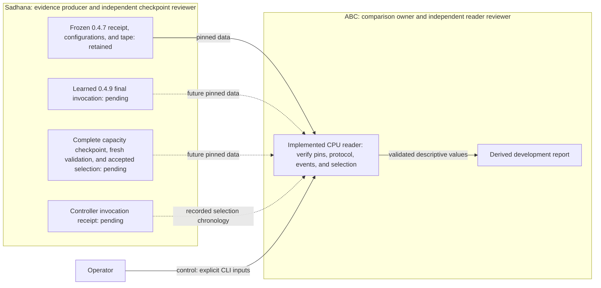

# ABC-VLA development comparison reader

`abc_bench.vla_comparison` reads retained ABC-VLA evidence on the CPU. It does not run a policy or simulator.
The historical `abc_bench.paired_eval` module uses ABC-DiT pilot artifacts. Those artifacts are incompatible with this reader.



The producer owns policy execution and raw evidence. The independent checkpoint reviewer owns the selection decision.
The ABC owner implements this reader. A second agent reviews its contract, tests, and baseline validation.
The coordinator owns package installation and publication. These steps require separate evidence.
The prose follows STE guidance. It has not had a full ASD-STE100 compliance check.

## Validate the retained frozen baseline

Use the supplied receipt hash. Do not replace it with a hash computed from an untrusted receipt.
After integration into the ABC checkout or package installation, run:

```sh
CUDA_VISIBLE_DEVICES='' MUJOCO_GL=disable \
OMP_NUM_THREADS=1 MKL_NUM_THREADS=1 OPENBLAS_NUM_THREADS=1 \
/home/user/aditya/RL/abc/.venv/bin/python -B -m abc_bench.vla_comparison \
  validate-baseline \
  --baseline /home/user/aditya/RL/abc/outputs/bench/qf3-vla-20261007T212522-b8a040/training/receipt.json \
  --baseline-sha256 1c51c0aa2b67729876dc987549818abf509d0b4818ff457197597ee5d82db7ba
```

The command uses the durable ABC environment. Installation validation is a separate coordinator check.
Use `--output NEW_PATH` to create a derived JSON report. Existing output files are refused.
Failures return exit code 1 and a `rejected` record. Success returns exit code 0.

The actual baseline validation recomputed 10 history successes and 7 native-current successes from 50 complete worlds.
The successful-only mean was 935.9 control steps. The failure-inclusive mean was 987.18 control steps.
The tape contained 49,359 active world steps and 1,000 physics ticks.
The other submitted commands hold worlds that have already completed their episodes.
This check consumed existing evidence. It did not perform a new experiment.

## Input contract

The public API accepts `Artifact(path, sha256, bytes=None)` values.
`validate_baseline(receipt)` needs only the frozen receipt.
`compare(baseline_receipt, learned_receipt, selection, learned_parent)` needs all four pinned inputs.
The CLI accepts each path with its `--NAME-sha256` argument. Missing learned inputs fail comparison.
No real learned receipt or selection manifest exists for this comparison yet.

The reader parses and hashes the same JSON byte snapshot. Duplicate keys and nonfinite numbers are refused.
It streams binary hashes, including the complete 8.8 GB base checkpoint. It does not load checkpoint tensors.
It verifies all referenced runtime sources, native inventory entries, configuration files, evaluation tapes, and capacity validation artifacts.
Files must remain immutable during validation. The reader rechecks binary content instead of trusting timestamp-based hash caches.
Hashes bind bytes. They do not establish producer truth.

The reader admits these reviewed producer versions only:

| Evidence | Worker | Collector |
| --- | --- | --- |
| Historical frozen baseline | 0.4.7, `sadhana.qf3-native-worker/2` | Reviewed 0.4.7 source pin |
| Future learned evaluation and capacity evidence | 0.4.9, `sadhana.qf3-native-worker/4` | Reviewed 0.4.9 source pin |

Both policies must share the runtime identity, public base weights, prompt, statistics, native sources, assets, and compiled actuator profile.
The report records the worker and collector source differences. It does not claim identical native geometry or trajectories.

Both fixed evaluations must use these settings:

| Field | Required value |
| --- | --- |
| Task and judge | Five bottles; `sadhana.qf3-abc-first-placement/1` |
| Flow proposal and execution | 30 actions; first 15 issued; five reverse Euler steps |
| Raw camera capture | Height 168, width 224; separate model preprocessing |
| Episode timeout | 1,000 control steps |
| Group and encoding | 50 worlds; encoder microbatch 4 |
| Requested and actual ordered seeds | 1,000,000 through 1,000,049 |
| Sampler seed | 91,001 |
| Action path | No added projection; submitted physical controls |

The learned receipt must be complete. It must contain one new `invocation_evaluation_events` event with `head=learned` and `reason=final`.
The event must bind the invocation tape. Inherited periodic history cannot satisfy this requirement.
All 50 episodes must complete. The positive invocation step count must equal the retained active steps.
The worker must report a verified training-state restore, positive actor updates, and unchanged training state across evaluation.
These hashes describe whole training-state preservation. They are not independent tensor inspection or physical-world restore proof.

## Accepted selection contract

Supply an independently accepted manifest. The reader never creates a real selection manifest.
The manifest requires `schema_version=1`, `kind=qf3_development_checkpoint_selection`, `status=accepted`, and `independent_review=true`.
It requires a timezone-aware `selected_at_utc`, the exact `SELECTION_RULE`, and these pinned references:

- `checkpoint`: a `qf3_completed_boundary_checkpoint` artifact.
- `capacity_receipt` and `capacity_resolved_config`: the actual selected run and configuration.
- `validation_manifest`: the final complete fresh-validation manifest from that capacity run.
- `base_id`, `source_sha256`, `policy_state_sha256`, `actor_updates=200`, and `critic_updates=1600`.

The capacity run must start from the candidate and complete four batches of 80 warmup episodes.
It must complete one 16-world training batch, 1,600 ordinary critic updates, 200 actor updates, and a complete fresh50 validation.
The required batch sizes are 64 and 256. Replay capacity is 50,000.
The reader checks the full explicit learner recipe, update cadence, and seed 903 against the accepted proposal.
It refuses reduced recipes, partial boundaries, pending validation, and incomplete warmup or rollout evidence.
A capacity `budget_stopped` status is admitted only at this complete one-outer boundary.
Early success can leave the nominal 16,000-step target unreached. This exception does not admit partial capacity runs.

Fresh validation uses requested seeds `2**40 + j*200001`, for `j=0..49`, and noise seed 91,002.
The public reset can use the requested seed or its one permitted `+100000` fallback.
Manifest, reset, tape world rows, and decision rows must agree on those actual seeds.
The reader recomputes the fresh event outcomes and checks its complete summary and preserved training-state hashes.

`policy_state_sha256` describes the full bridge state at the capacity validation boundary, including both heads and bridge RNG.
It is not an isolated online adapter tensor hash. The selected checkpoint bytes bind the learned invocation's resume input.
Tensor content and the capacity acceptance decision remain the responsibility of the independent checkpoint reviewer.

The pinned learned parent must bind the worker receipt, requested configuration, and fixed evaluation metadata.
Its recorded `created_at` must follow the recorded selection time.
This establishes consistency with externally recorded chronology. It does not cryptographically prove when the selection file existed.

## Reported values and limits

The reader recomputes placement transitions, rewards, episode lengths, and both success definitions from retained decision events.
It checks world trackers, world summaries, physical tape dimensions, and worker aggregates against those values.
History success means all five bottles were placed at least once.
Native-current success is the stock judge result at that history-defined episode's end.
Episode lengths are not native first-success times.

The report pairs worlds by their exact requested and actual fixed seeds.
It reports wins, losses, both-success, and neither-success counts for each success definition.
It reports each policy's successful-only mean and failure-inclusive mean separately.
It reports common-success paired length changes separately. Empty successful sets have a null mean.
Different successful subsets do not establish a speed gain.

This is a descriptive development comparison. It provides no p-values, causal RL gain, held-out result, author result, or reproduction claim.
The exact paper initializer remains unconfirmed. Performance claims depend on retained events and externally accepted producer metadata.
The unit tests use explicit synthetic learned fixtures. Their outputs are software checks, not published benchmark results.
